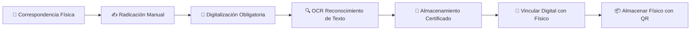
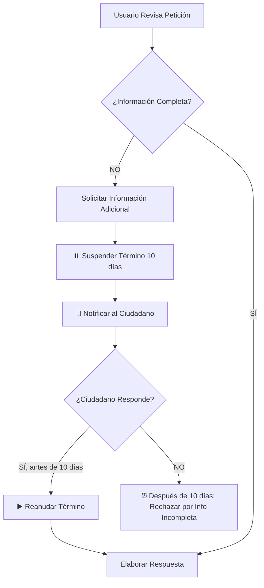

# ANÁLISIS CRÍTICO Y FUNDAMENTACIÓN JURÍDICA
## Software de Correspondencia Hospitalaria

**Fecha de Análisis:** 21 de octubre de 2025  
**Analista:** Inteligencia Artificial - Asistente de Código  
**Alcance:** Sistema de Gestión de Correspondencia para Entidades Hospitalarias Públicas en Colombia

---

## 📋 TABLA DE CONTENIDO

1. [Resumen Ejecutivo](#resumen-ejecutivo)
2. [Análisis Crítico del Flujograma](#análisis-crítico-del-flujograma)
3. [Fundamentación Jurídica por Proceso](#fundamentación-jurídica-por-proceso)
4. [Elementos Faltantes Críticos](#elementos-faltantes-críticos)
5. [Recomendaciones de Mejora](#recomendaciones-de-mejora)
6. [Conclusiones](#conclusiones)

---

## 🎯 RESUMEN EJECUTIVO

El flujograma presentado describe un sistema de correspondencia hospitalaria que abarca desde la recepción (física y electrónica) hasta el envío de respuestas. Tras un análisis exhaustivo, se han identificado **fortalezas significativas** en la estructura del flujo, pero también **elementos faltantes críticos** que podrían comprometer el cumplimiento normativo y la eficiencia operacional.

### Fortalezas Identificadas:
✅ Generación automática de radicados  
✅ Cálculo de SLA con calendario laboral  
✅ Trazabilidad mediante historial  
✅ Flujo de aprobación de respuestas  
✅ Control de rebotes de correo electrónico  

### Aspectos Críticos Faltantes:
❌ Digitalización de correspondencia física  
❌ Protección de datos personales sensibles  
❌ Conservación documental según TRD  
❌ Firma digital y valor probatorio  
❌ Gestión de PQRSDF específicas  

---

## 🔍 ANÁLISIS CRÍTICO DEL FLUJOGRAMA

### 1. ENTRADA Y RADICACIÓN

#### ✅ **Aspectos Positivos:**
- Contempla dos medios de entrada (físico y electrónico)
- Generación automática de número de radicado único
- Protocolo IMAP para recepción de emails

#### ⚠️ **Elementos Faltantes:**

##### **1.1. Digitalización de Correspondencia Física**
**CRÍTICO:** El flujograma no contempla el proceso de digitalización obligatoria de documentos físicos.

**Impacto:** 
- Imposibilidad de gestión integral digital
- Incumplimiento de políticas de cero papel
- Dificultad en la trazabilidad completa
- Problemas de consulta remota

**Solución Requerida:**
```
[📄 Radicación Física] --> [📸 Digitalización Obligatoria] 
                      --> [💾 Almacenamiento Digital Certificado]
                      --> [🔢 Generación Radicado]
```

##### **1.2. Validación de Identidad del Remitente**
**MODERADO:** No se verifica la identidad del remitente en correspondencia física.

**Riesgo:**
- Suplantación de identidad
- Documentos fraudulentos
- Problemas legales posteriores

**Solución:**
- Validación de documento de identidad
- Registro fotográfico del remitente (opcional)
- Firma del receptor en formulario de radicación

##### **1.3. Clasificación de Seguridad de la Información**
**CRÍTICO:** No se clasifica el nivel de confidencialidad del documento.

**Niveles Faltantes:**
- 🔴 **CONFIDENCIAL:** Datos sensibles de salud (Historia clínica)
- 🟡 **RESERVADO:** Información administrativa sensible
- 🟢 **PÚBLICO:** Información general

---

### 2. CLASIFICACIÓN Y ASIGNACIÓN

#### ✅ **Aspectos Positivos:**
- Clasificación por Serie y Subserie Documental
- Clasificación de tipo de trámite
- Cálculo automático de SLA basado en subserie

#### ⚠️ **Elementos Faltantes:**

##### **2.1. Validación de Competencia**
**IMPORTANTE:** No se verifica si la entidad es competente para atender la solicitud.

**Problema:**
- Recepción de solicitudes fuera de competencia
- Retrasos en traslado a entidad competente
- Vulneración del derecho de petición

**Solución:**
```
[📋 Clasificación] --> {¿Es competente la entidad?}
                  |---> [SÍ] --> [Asignación a Oficina]
                  |---> [NO] --> [Traslado Entidad Competente]
                                 [Notificación al Peticionario]
```

##### **2.2. Identificación de PQRSDF**
**CRÍTICO:** No se distinguen específicamente las PQRSDF (Peticiones, Quejas, Reclamos, Sugerencias, Denuncias, Felicitaciones).

**Importancia Jurídica:**
- Plazos diferentes según tipo
- Obligaciones específicas por tipo
- Reportes obligatorios a entes de control

**Clasificación Requerida:**
- **PETICIÓN:** 15 días hábiles (Ley 1755/2015)
- **QUEJA:** 15 días hábiles
- **RECLAMO:** 15 días hábiles
- **CONSULTA:** 30 días hábiles
- **INFORMACIÓN INCOMPLETA:** 10 días para completar

##### **2.3. Registro de Anexos**
**MODERADO:** No se registra la cantidad y tipo de anexos recibidos.

**Problema:**
- Pérdida de documentos anexos
- Imposibilidad de verificación posterior
- Reclamos por documentos faltantes

---

### 3. NOTIFICACIONES Y GESTIÓN

#### ✅ **Aspectos Positivos:**
- Sistema de notificaciones automáticas
- Alertas de SLA próximo a vencer
- Bandeja personal y de oficina

#### ⚠️ **Elementos Faltantes:**

##### **3.1. Acuse de Recibo Automático**
**IMPORTANTE:** No se genera acuse de recibo para el ciudadano.

**Obligación Legal:**
- **Ley 1755 de 2015, Art. 14:** "Radicación. Toda petición dirigida a las autoridades deberá ser radicada el mismo día de su recibo, en las condiciones señaladas en el Código de Procedimiento Administrativo y de lo Contencioso Administrativo."

**Solución:**
```
[🔢 Generación Radicado] --> [📧 Envío Automático Acuse de Recibo]
                         --> [Correo electrónico con: 
                              - Número de radicado
                              - Fecha de radicación
                              - Oficina asignada
                              - Plazo de respuesta
                              - Enlace consulta estado]
```

##### **3.2. Notificación de Cambios de Estado**
**MODERADO:** Solo notifica al recibir, no en cambios de estado.

**Estados que deberían notificar:**
- Asignación a usuario específico
- Traslado a otra dependencia
- Solicitud de información adicional
- Próximo a vencer (al ciudadano)
- Respuesta lista para consulta

##### **3.3. Sistema de Recordatorios Escalonados**
**IMPORTANTE:** Las alertas de SLA deberían ser progresivas.

**Propuesta:**
- 🟢 **75% del tiempo:** Recordatorio suave
- 🟡 **90% del tiempo:** Alerta importante
- 🟠 **95% del tiempo:** Alerta crítica (copia a supervisor)
- 🔴 **100% del tiempo:** Vencido (escalamiento automático)

---

### 4. PROCESAMIENTO Y RESPUESTA

#### ✅ **Aspectos Positivos:**
- Opciones múltiples de acción (compartir, redistribuir, responder)
- Flujo de aprobación de respuestas
- Validación de email destinatario

#### ⚠️ **Elementos Faltantes:**

##### **4.1. Firma Digital de Respuestas**
**CRÍTICO:** No se contempla la firma digital de las respuestas oficiales.

**Obligación Legal:**
- **Ley 527 de 1999:** Define y reglamenta el acceso y uso de mensajes de datos, del comercio electrónico y de las firmas digitales.
- **Decreto 1074 de 2015, Art. 2.2.2.48.1:** Reglamenta la firma electrónica.

**Problema:**
- Falta de valor probatorio
- No repudio de autoría
- Vulnerabilidad a modificaciones

**Solución:**
```
[✅ Aprobar Respuesta] --> [🔐 Firma Digital Funcionario Competente]
                       --> [🔏 Sello Digital de Tiempo]
                       --> [📤 Envío]
```

##### **4.2. Solicitud de Información Adicional**
**IMPORTANTE:** No existe flujo para solicitar información incompleta.

**Obligación Legal:**
- **Ley 1755 de 2015, Art. 16:** "Cuando se requiera información adicional, se suspenderá el término por máximo 10 días."

**Flujo Faltante:**
```
[📋 Analizar Solicitud] --> {¿Información completa?}
                        |---> [NO] --> [📝 Solicitar Información]
                        |             [⏸️ Suspensión Término 10 días]
                        |             [🔄 Esperar Respuesta Ciudadano]
                        |---> [SÍ] --> [💬 Elaborar Respuesta]
```

##### **4.3. Proyección y Revisión de Respuestas**
**MODERADO:** El flujo de aprobación es binario (aprobar/rechazar).

**Necesidad:**
- **Proyección:** Usuario asignado elabora borrador
- **Revisión Técnica:** Jefe inmediato revisa técnicamente
- **Revisión Jurídica:** Si aplica, abogado revisa
- **Firma Competente:** Quien tiene competencia firma

**Roles Faltantes:**
- Proyecta: Profesional asignado
- Revisa: Coordinador/Jefe
- Verifica: Jurídica (casos complejos)
- Aprueba: Director/Gerente (según competencia)

##### **4.4. Gestión de Prórrogas**
**IMPORTANTE:** No contempla solicitud de prórroga para respuesta.

**Obligación Legal:**
- **Ley 1755 de 2015, Art. 17:** Prórroga excepcional por circunstancias especiales.

---

### 5. ENVÍO Y SEGUIMIENTO

#### ✅ **Aspectos Positivos:**
- Validación de email con MX/SMTP
- Seguimiento DSN (Delivery Status Notification)
- Control de rebotes y errores

#### ⚠️ **Elementos Faltantes:**

##### **5.1. Notificación Multicanal**
**IMPORTANTE:** Solo contempla email, no otros canales de notificación.

**Canales Faltantes:**
- 📧 **Email:** Implementado ✅
- 📱 **SMS:** Para alertas críticas
- 📞 **Llamada automática:** Casos urgentes
- 📬 **Correo certificado:** Cuando email falla
- 🌐 **Publicación web:** Notificación por aviso

**Obligación Legal:**
- **Ley 1437 de 2011, Art. 69:** Cuando no sea posible la notificación electrónica, se hará por correo físico o aviso.

##### **5.2. Confirmación de Lectura**
**MODERADO:** No se confirma que el destinatario leyó el mensaje.

**Problema:**
- No se sabe si el ciudadano recibió la respuesta
- Posibles reclamos posteriores
- Problemas en notificaciones de actos administrativos

**Solución:**
- Solicitar acuse de lectura en emails
- Portal de consulta que registre accesos
- Enlace único para cada destinatario

##### **5.3. Archivo Digital Certificado**
**CRÍTICO:** No se menciona el almacenamiento certificado final.

**Obligación Legal:**
- **Ley 594 de 2000, Art. 46:** Los documentos electrónicos deben almacenarse con garantía de inalterabilidad.

---

### 6. FUNCIONES TRANSVERSALES

#### ✅ **Aspectos Positivos:**
- Generación automática de radicados
- Cálculo automático de SLA con calendario laboral
- Registro automático de historial
- Validación automática de emails

#### ⚠️ **Elementos Faltantes:**

##### **6.1. Gestión de Tabla de Retención Documental (TRD)**
**CRÍTICO:** No se contempla la disposición final según TRD.

**Obligación Legal:**
- **Acuerdo AGN 060 de 2001:** Establece pautas para las TRD.

**Elementos Faltantes:**
```
Serie/Subserie --> Tiempo de Conservación
              --> Destino Final (Conservación Total / Eliminación / Selección)
              --> Soporte (Físico / Digital / Ambos)
```

##### **6.2. Copias de Seguridad (Backup)**
**CRÍTICO:** No se menciona el sistema de respaldo.

**Requerimientos:**
- Backup diario automático
- Backup incremental horario
- Almacenamiento en ubicación diferente
- Pruebas de recuperación periódicas

##### **6.3. Integración con Otros Sistemas**
**IMPORTANTE:** No se menciona integración con sistemas externos.

**Integraciones Necesarias:**
- **Historia Clínica Electrónica:** Para contexto de correspondencia clínica
- **Sistema Financiero:** Para solicitudes de reembolsos, pagos
- **Sistema de Recursos Humanos:** Para solicitudes de certificados laborales
- **PQRS Nacional:** Reportes a Superintendencia

##### **6.4. Generación de Reportes Estadísticos**
**IMPORTANTE:** No hay módulo de reportes y analítica.

**Reportes Obligatorios:**
- Cantidad de correspondencia por tipo y mes
- Cumplimiento de términos legales
- Correspondencia vencida por dependencia
- Motivos de rechazo de respuestas
- Rebotes de correo electrónico
- Tiempos promedio de respuesta

---

## ⚖️ FUNDAMENTACIÓN JURÍDICA POR PROCESO

A continuación se detalla la base legal específica para cada elemento del flujograma:

---

### 📥 **1. ENTRADA - RECEPCIÓN DE CORRESPONDENCIA**

#### **Proceso:** Llegada de Correspondencia (Físico y Electrónico)

**MARCO LEGAL:**

##### **Ley 594 de 2000 - Ley General de Archivos**
- **Artículo 22:** "Los documentos de archivo son bienes de interés público y, en consecuencia, les será aplicable el régimen especial de protección que para ellos se establezca."
  
  **Aplicación al Flujograma:** Toda correspondencia recibida, sin importar su medio (físico o electrónico), constituye un documento de archivo y debe recibir protección especial desde su ingreso al sistema.

- **Artículo 24:** "Las entidades públicas y las privadas que cumplen funciones públicas deberán establecer programas de gestión documental que comprendan la producción o recepción, distribución, trámite, organización, consulta, conservación y disposición final de los documentos."
  
  **Aplicación:** Justifica la necesidad de sistematizar la recepción mediante radicación automatizada.

##### **Decreto 1080 de 2015 - Sector Cultura (Gestión Documental)**
- **Artículo 2.8.2.4.1:** "Las entidades deberán implementar programas de gestión documental que incluyan la automatización de procesos y el uso de tecnologías de la información."
  
  **Aplicación:** Fundamenta el uso del Protocolo IMAP para la recepción automática de correos electrónicos.

##### **Ley 527 de 1999 - Comercio Electrónico y Firma Digital**
- **Artículo 10:** "Los mensajes de datos serán admisibles como medios de prueba y su fuerza probatoria es la otorgada en el Código de Procedimiento Civil."
  
  **Aplicación:** La correspondencia electrónica tiene la misma validez legal que la física.

---

### 🔢 **2. GENERACIÓN DE RADICADO ENTRANTE**

#### **Proceso:** Asignación de número único de radicado (ENTRANTE-2025-XXXXX)

**MARCO LEGAL:**

##### **Ley 594 de 2000 - Ley General de Archivos**
- **Artículo 12, literal c):** "Establecer un sistema integrado de conservación en cada entidad del Estado, que garantice la preservación del patrimonio documental del país."
  
  **Aplicación:** El número de radicado único garantiza la identificación inequívoca de cada documento dentro del sistema de conservación.

##### **Resolución 310 de 2011 - Superintendencia Nacional de Salud**
- **Artículo 2:** "La radicación es el procedimiento que se aplica con el propósito de oficializar el trámite de las comunicaciones oficiales y cumplir con los términos de vencimiento que establece la ley."
  
  **Aplicación DIRECTA:** Esta es la norma específica que obliga a la radicación en entidades de salud.

##### **Ley 1437 de 2011 - Código de Procedimiento Administrativo (CPACA)**
- **Artículo 14, parágrafo 3:** "Las entidades llevarán un registro en orden cronológico de todas las actuaciones."
  
  **Aplicación:** El consecutivo anual (00001, 00002...) cumple con el orden cronológico exigido.

##### **Ley 1755 de 2015 - Derecho de Petición**
- **Artículo 14:** "Radicación. Toda petición dirigida a las autoridades deberá ser radicada el mismo día de su recibo, en las condiciones señaladas en el Código de Procedimiento Administrativo y de lo Contencioso Administrativo."
  
  **Aplicación CRÍTICA:** Obliga a que el sistema genere el radicado automáticamente el mismo día de recepción. NO puede diferirse.

**FORMATO REQUERIDO:**
```
ENTRANTE-[AÑO]-[CONSECUTIVO DE 5 DÍGITOS]
Ejemplo: ENTRANTE-2025-00001
```

**JUSTIFICACIÓN DEL FORMATO:**
- **ENTRANTE:** Identifica el tipo de radicado
- **2025:** Permite control por vigencia fiscal y anual
- **00001:** Consecutivo que garantiza unicidad

---

### 📚 **3. CLASIFICACIÓN DOCUMENTAL**

#### **Proceso:** Asignación de Serie y Subserie Documental

**MARCO LEGAL:**

##### **Acuerdo AGN 060 de 2001 - Archivo General de la Nación**
**NORMA FUNDAMENTAL PARA CLASIFICACIÓN**

- **Artículo 1:** "Las entidades públicas deberán elaborar y adoptar sus respectivas Tablas de Retención Documental."
  
  **Aplicación:** Obliga a que el sistema tenga precargadas las series y subseries documentales aprobadas por el Comité de Archivo de la entidad.

- **Artículo 3:** "La Tabla de Retención Documental debe contener: Código de la serie o subserie documental, Nombre de la serie o subserie documental, Tiempo de retención en Archivo de Gestión, Tiempo de retención en Archivo Central, Disposición final (E = Eliminación, CT = Conservación Total, S = Selección, M = Microfilmación, D = Digitalización)."
  
  **Aplicación al Flujograma:** La clasificación en serie/subserie NO es solo administrativa, determina:
  - **Tiempo de conservación** del documento
  - **Disposición final** (si se elimina o conserva permanentemente)
  - **Responsabilidad legal** de conservación

##### **Ley 594 de 2000**
- **Artículo 21:** "Los documentos de archivo deben ser organizados de acuerdo con las Tablas de Retención Documental aprobadas por el Archivo General de la Nación o por los Consejos Departamentales, Distritales o Municipales de Archivos, según corresponda."

**EJEMPLO PRÁCTICO:**

| Serie | Subserie | Tiempo Gestión | Tiempo Central | Disposición |
|-------|----------|----------------|----------------|-------------|
| Correspondencia Entrante | Peticiones de Información | 2 años | 5 años | E (Eliminación) |
| Correspondencia Entrante | Derechos de Petición | 5 años | 10 años | CT (Conservación Total) |
| Correspondencia Entrante | Historias Clínicas | Permanente | Permanente | CT (Conservación Total) |

**IMPACTO EN EL SISTEMA:**
- La clasificación debe ser **obligatoria** (no opcional)
- Debe disparar el cálculo de plazos de conservación
- Debe registrarse en el historial para auditoría

---

### ⏰ **4. CLASIFICACIÓN DE TIEMPO DE TRÁMITE - SLA**

#### **Proceso:** Asignación automática de plazo de respuesta según subserie + configuración

**MARCO LEGAL:**

##### **Ley 1755 de 2015 - Derecho de Petición**
**NORMA PRINCIPAL PARA PLAZOS**

- **Artículo 14:** "El término máximo para resolver las peticiones de información es de diez (10) días."
  
  **Aplicación:** Peticiones de información pública = 10 días hábiles.

- **Artículo 17:** "Prórroga. Cuando excepcionalmente, por circunstancias especiales, no fuere posible resolver la petición en el plazo correspondiente, la autoridad deberá informar esta circunstancia al interesado, antes del vencimiento del término señalado en la ley expresando los motivos de la demora y señalando a la vez el plazo razonable en que se resolverá o dará respuesta."
  
  **Aplicación al Sistema:** El software debe permitir solicitar prórrogas y notificar automáticamente al ciudadano. **FALTA EN EL FLUJOGRAMA.**

##### **Ley 1437 de 2011 - CPACA**
- **Artículo 13:** "Derecho de petición de interés general. Toda persona puede hacer peticiones respetuosas a las autoridades en el interés general o particular. El término para resolver estas peticiones será de quince (15) días."
  
  **Aplicación:** Peticiones de interés general y particular = 15 días hábiles.

- **Artículo 23:** "Consultas. Las consultas que formulen los particulares a las autoridades en materias relacionadas con sus actuaciones y con la aplicación de las normas a situaciones de carácter general, deberán resolverse dentro de los treinta (30) días siguientes a su recepción."
  
  **Aplicación:** Consultas técnicas o jurídicas = 30 días hábiles.

##### **Ley 1581 de 2012 - Habeas Data**
- **Artículo 15, numeral 5:** "Respuesta de la solicitud. El término máximo para atender la solicitud será de quince (15) días hábiles."
  
  **Aplicación:** Solicitudes de datos personales (consulta, corrección, supresión) = 15 días hábiles.

##### **Decreto 2106 de 2019 - Trámites en Salud**
- **Artículo 15:** Establece tiempos específicos para respuestas en el sector salud.

**TABLA DE PLAZOS LEGALES:**

| Tipo de Correspondencia | Plazo Legal | Base Legal | Config. Sistema |
|-------------------------|-------------|------------|-----------------|
| Información pública | 10 días hábiles | Ley 1755/2015, Art. 14 | `INFORMACION = 10` |
| Petición interés particular | 15 días hábiles | Ley 1437/2011, Art. 13 | `NORMAL = 15` |
| Consulta técnica | 30 días hábiles | Ley 1437/2011, Art. 23 | `CONSULTA = 30` |
| Queja/Reclamo | 15 días hábiles | Ley 1755/2015 | `NORMAL = 15` |
| Habeas Data | 15 días hábiles | Ley 1581/2012, Art. 15 | `HABEAS_DATA = 15` |
| Tutela | 10 días hábiles | Decreto 2591/1991 | `MUY_URGENTE = 3` ⚠️ |

**⚠️ OBSERVACIÓN CRÍTICA:**
El sistema actualmente solo tiene:
- NORMAL = 15 días
- URGENTE = 5 días
- MUY_URGENTE = 3 días

**FALTA:** Configuración específica para tipo de petición (información, consulta, habeas data), no solo por urgencia.

**SOLUCIÓN RECOMENDADA:**
```python
# En models.py - Nueva configuración
TIPO_PETICION_CHOICES = [
    ('INFORMACION', 'Solicitud de Información (10 días)'),
    ('PETICION_GRAL', 'Petición General (15 días)'),
    ('CONSULTA', 'Consulta Técnica (30 días)'),
    ('HABEAS_DATA', 'Habeas Data (15 días)'),
    ('QUEJA', 'Queja (15 días)'),
    ('RECLAMO', 'Reclamo (15 días)'),
    ('SUGERENCIA', 'Sugerencia (15 días)'),
]

PLAZO_LEGAL_MAP = {
    'INFORMACION': 10,
    'PETICION_GRAL': 15,
    'CONSULTA': 30,
    'HABEAS_DATA': 15,
    'QUEJA': 15,
    'RECLAMO': 15,
    'SUGERENCIA': 15,
}
```

---

### 🔔 **5. NOTIFICACIÓN AUTOMÁTICA**

#### **Proceso:** Sistema de notificaciones a usuarios asignados

**MARCO LEGAL:**

##### **Ley 1437 de 2011 - CPACA**
- **Artículo 67:** "Las notificaciones se harán por medios electrónicos cuando el interesado haya autorizado expresamente este medio."
  
  **Aplicación:** Las notificaciones internas (entre funcionarios) pueden ser electrónicas por defecto.

##### **Decreto 1078 de 2015**
- **Artículo 2.2.8.2.2.2:** Regula el servicio postal y las comunicaciones oficiales.

**ELEMENTOS QUE DEBE CONTENER LA NOTIFICACIÓN:**
1. Número de radicado
2. Remitente
3. Asunto
4. Fecha de radicación
5. **Plazo de vencimiento** (fecha exacta)
6. Días restantes
7. Enlace directo al documento

**⚠️ FALTA EN EL FLUJOGRAMA:**
- No se genera acuse de recibo automático al ciudadano
- No se notifica al ciudadano sobre cambios de estado
- No hay notificaciones multicanal (solo sistema, no email/SMS)

---

### 📋 **6. HISTORIAL Y TRAZABILIDAD**

#### **Proceso:** Registro automático de eventos en el ciclo de vida del documento

**MARCO LEGAL:**

##### **Ley 594 de 2000**
- **Artículo 15:** "Los documentos de archivo de las entidades públicas deberán ser organizados de tal forma que se facilite su consulta."
  
  **Aplicación:** El historial debe permitir reconstruir todo el ciclo de vida del documento.

##### **Ley 1712 de 2014 - Transparencia**
- **Artículo 16:** "Los sujetos obligados deberán asegurar que existan procedimientos claros para la creación, gestión, organización y conservación de sus archivos, conforme con los lineamientos que expida para el efecto el Archivo General de la Nación."
  
  **Aplicación:** Obliga a mantener trazabilidad completa para auditorías y transparencia.

##### **Decreto 1080 de 2015**
- **Artículo 2.8.2.5.8:** Establece requisitos de metadatos mínimos para documentos electrónicos.

**METADATOS MÍNIMOS OBLIGATORIOS:**
1. Fecha y hora de cada acción
2. Usuario que ejecuta la acción
3. Tipo de acción (radicar, leer, redistribuir, responder)
4. IP de origen (seguridad)
5. Descripción del evento

**EVENTOS QUE DEBEN REGISTRARSE:**
```
✅ RADICADA
✅ ASIGNADA_USUARIO
✅ LEIDA
⚠️ REDISTRIBUIDA (FALTA)
⚠️ COMPARTIDA (FALTA)
✅ RESPONDIDA
⚠️ PRORROGADA (FALTA)
⚠️ TRASLADADA (FALTA)
⚠️ ARCHIVADA (FALTA)
```

---

### 📤 **7. RESPUESTA Y ENVÍO**

#### **Proceso:** Elaboración, aprobación y envío de respuestas

**MARCO LEGAL:**

##### **Ley 1755 de 2015**
- **Artículo 22:** "Motivación. La motivación de la respuesta debe ser clara, precisa y congruente con lo solicitado."
  
  **Aplicación:** El sistema debe permitir que el funcionario redacte respuestas completas y motivadas.

##### **Ley 527 de 1999 - Firma Digital**
- **Artículo 7:** "Cuando una norma exija la firma de una persona, ese requisito se entenderá satisfecho cuando se haya utilizado una firma digital."
  
  **Aplicación CRÍTICA:** Las respuestas oficiales deberían estar firmadas digitalmente. **FALTA EN EL FLUJOGRAMA.**

- **Artículo 28:** "Mensaje de datos elaborado por una entidad pública. Los mensajes de datos elaborados por las entidades públicas en ejercicio de sus funciones se entienden expedidos como documentos originales."

##### **Decreto 1074 de 2015 - Firma Electrónica**
- **Artículo 2.2.2.48.1 y siguientes:** Reglamenta el uso de la firma electrónica en entidades públicas.

**⚠️ ELEMENTOS CRÍTICOS FALTANTES:**

1. **Firma Digital/Electrónica:**
```
[Aprobar Respuesta] --> [⚠️ FALTA: Firma Digital]
                    --> [📤 Envío]
```

2. **Sello Digital de Tiempo:**
   - **Acuerdo AGN 003 de 2015:** Establece lineamientos para documentos electrónicos.
   - Debe incluirse timestamp certificado para valor probatorio.

3. **Archivo Certificado:**
   - Debe guardarse copia certificada de la respuesta enviada
   - Hash SHA-256 para verificar integridad
   - Metadatos de envío (hora, destinatario, adjuntos)

---

### 📧 **8. VALIDACIÓN Y ENVÍO DE EMAIL**

#### **Proceso:** Validación SMTP/MX y Delivery Status Notification (DSN)

**MARCO LEGAL:**

##### **Ley 527 de 1999**
- **Artículo 13:** "Expedición y recepción de mensajes de datos. Salvo que el emisor y el receptor acuerden otra cosa, el mensaje de datos se entenderá expedido cuando ingrese en un sistema de información que no esté bajo el control del iniciador."
  
  **Aplicación:** El envío se perfecciona cuando el email sale del servidor SMTP de la entidad.

##### **RFC 3461 - SMTP Service Extension for Delivery Status Notifications**
**ESTÁNDAR TÉCNICO (No es ley, pero es la norma técnica internacional)**

**Aplicación:** El seguimiento DSN permite determinar:
- Email entregado exitosamente
- Email rebotado (bounce)
- Email rechazado por filtros
- Buzón lleno

**⚠️ RECOMENDACIONES:**

1. **Registro de Intentos:**
```sql
CREATE TABLE email_delivery_log (
    id SERIAL PRIMARY KEY,
    correspondencia_salida_id INT,
    destinatario EMAIL,
    fecha_intento TIMESTAMP,
    codigo_smtp VARCHAR(10),  -- 250, 550, 552, etc.
    mensaje_respuesta TEXT,
    dsn_status VARCHAR(20),   -- delivered, bounced, rejected
    reintentos INT DEFAULT 0
);
```

2. **Política de Reintentos:**
- Primer intento: Inmediato
- Segundo intento: 15 minutos después
- Tercer intento: 1 hora después
- Cuarto intento: 4 horas después
- Después: Notificar fallo y sugerir canal alternativo

3. **Canales Alternativos:**
Si el email falla después de N intentos:
```
[Email Falla] --> [Notificar al Funcionario]
              --> [Sugerir: Correo Certificado / Publicación Web / Notificación Personal]
```

---

### 🔐 **9. PROTECCIÓN DE DATOS PERSONALES**

#### **⚠️ CRÍTICO: NO CONTEMPLADO EN EL FLUJOGRAMA**

**MARCO LEGAL:**

##### **Ley 1581 de 2012 - Protección de Datos Personales**
**NORMA FUNDAMENTAL QUE FALTA**

- **Artículo 4:** "Principios rectores:
  a) **Principio de legalidad**
  b) **Principio de finalidad**
  c) **Principio de libertad**
  d) **Principio de veracidad o calidad**
  e) **Principio de transparencia**
  f) **Principio de acceso y circulación restringida**
  g) **Principio de seguridad**
  h) **Principio de confidencialidad**"
  
  **Aplicación:** TODO el sistema de correspondencia debe cumplir estos principios.

- **Artículo 17:** "Deberes de los responsables del tratamiento de datos personales:
  - Garantizar al Titular el ejercicio del derecho de hábeas data
  - Conservar la información bajo las condiciones de seguridad necesarias
  - **Realizar la supresión de datos cuando así lo ordene la autoridad competente**"

##### **Ley 23 de 1981 - Ética Médica**
- **Artículo 34:** "La historia clínica es un documento privado sometido a reserva, que únicamente puede ser conocido por terceros previa autorización del paciente o en los casos previstos por la ley."
  
  **Aplicación CRÍTICA:** La correspondencia que contenga información clínica debe tener controles de acceso estrictos.

**ELEMENTOS QUE DEBEN AGREGARSE AL FLUJOGRAMA:**

1. **Clasificación de Sensibilidad:**
```
[📥 Recepción] --> [🔍 Clasificar Contenido]
               --> {¿Contiene datos sensibles?}
               |---> [SÍ] --> [🔐 Marcar como CONFIDENCIAL]
               |           --> [🚨 Aplicar restricciones de acceso]
               |---> [NO] --> [Flujo normal]
```

2. **Control de Acceso Basado en Roles (RBAC):**
```
- Ventanilla Única: Solo lectura metadatos, NO contenido sensible
- Funcionario Asignado: Acceso completo
- Jefe de Área: Acceso completo a su área
- Auditor: Solo lectura
```

3. **Registro de Consultas:**
   - Quién accedió
   - Cuándo accedió
   - Qué campos consultó
   - Desde qué IP

4. **Anonimización para Reportes:**
   - Los reportes estadísticos NO deben mostrar nombres
   - Debe usarse ID pseudoanonimizado

---

### 📅 **10. CALENDARIO LABORAL Y CÁLCULO DE DÍAS HÁBILES**

#### **Proceso:** Cálculo automático de SLA considerando feriados

**MARCO LEGAL:**

##### **Ley 51 de 1983 - Días Feriados en Colombia**
Lista los días festivos oficiales en Colombia.

##### **Ley 1437 de 2011 - CPACA**
- **Artículo 30:** "Los términos de días se entienden hábiles."
  
  **Aplicación:** Todos los plazos deben calcularse en días hábiles, excluyendo:
  - Sábados
  - Domingos
  - Festivos nacionales

**IMPLEMENTACIÓN EN EL CÓDIGO:**

El archivo `feriados.csv` debe contener todos los festivos por año.

```python
# utils_sla.py - Fragmento del código actual
from datetime import timedelta

def es_dia_habil(fecha):
    """Retorna True si la fecha es día hábil"""
    # 1. Verificar que no sea sábado (5) ni domingo (6)
    if fecha.weekday() >= 5:
        return False
    
    # 2. Verificar que no esté en la tabla de feriados
    from .models import Feriado
    if Feriado.objects.filter(fecha=fecha).exists():
        return False
    
    return True

def sumar_habiles(fecha_inicio, dias_habiles):
    """Suma N días hábiles a una fecha"""
    fecha_actual = fecha_inicio
    dias_sumados = 0
    
    while dias_sumados < dias_habiles:
        fecha_actual += timedelta(days=1)
        if es_dia_habil(fecha_actual):
            dias_sumados += 1
    
    return fecha_actual
```

**⚠️ OBSERVACIÓN:**
El código implementa correctamente el cálculo de días hábiles. **✅ CORRECTO**

---

### 🗂️ **11. DISPOSICIÓN FINAL Y CONSERVACIÓN**

#### **⚠️ CRÍTICO: NO CONTEMPLADO EN EL FLUJOGRAMA**

**MARCO LEGAL:**

##### **Ley 594 de 2000**
- **Artículo 46:** "Conservación de documentos. Los documentos de archivo, sean estos privados o públicos, deberán mantenerse en buen estado y disponibles para su consulta."

##### **Acuerdo AGN 060 de 2001**
Establece tiempos de conservación según TRD.

**CICLO DE VIDA FALTANTE:**

```
[Correspondencia Respondida] --> [Archivo de Gestión (oficina)]
                             --> [Después de X años] --> [Traslado a Archivo Central]
                             --> [Después de Y años] --> {Disposición Final}
                                                      |---> [Conservación Total]
                                                      |---> [Eliminación Segura]
                                                      |---> [Selección Documental]
```

**ELEMENTOS A IMPLEMENTAR:**

1. **Estado de Conservación:**
```python
ESTADO_CONSERVACION_CHOICES = [
    ('ACTIVO', 'Archivo de Gestión (Activo)'),
    ('SEMIACTIVO', 'Archivo Central'),
    ('INACTIVO', 'Archivo Histórico'),
    ('ELIMINADO', 'Eliminado (Según TRD)'),
]
```

2. **Alertas de Transferencia:**
   - Cuando se cumple el tiempo en Archivo de Gestión
   - Cuando se cumple el tiempo en Archivo Central
   - Cuando se debe aplicar disposición final

3. **Proceso de Eliminación Certificada:**
   - Acta de eliminación
   - Aprobación del Comité de Archivo
   - Registro de documentos eliminados (metadatos se conservan)

---

## ❌ ELEMENTOS FALTANTES CRÍTICOS

### 1. **DIGITALIZACIÓN OBLIGATORIA DE CORRESPONDENCIA FÍSICA** ⚠️⚠️⚠️

**Impacto:** ALTO  
**Prioridad:** CRÍTICA

**Problema:**
El flujograma contempla radicación física, pero NO incluye el proceso de digitalización subsecuente. Esto genera:
- Documentos físicos sin respaldo digital
- Imposibilidad de consulta remota
- Vulnerabilidad ante pérdida o daño
- Incumplimiento de políticas de gestión documental electrónica

**Solución:**


**Base Legal:**
- **Decreto 2609 de 2012, Art. 9:** "Las entidades públicas deberán digitalizar los documentos que reposen en sus archivos."

---

### 2. **FIRMA DIGITAL EN RESPUESTAS OFICIALES** ⚠️⚠️⚠️

**Impacto:** ALTO  
**Prioridad:** CRÍTICA

**Problema:**
Las respuestas enviadas por email NO tienen firma digital, lo que genera:
- Falta de valor probatorio
- Posibilidad de repudio ("yo no envié eso")
- Vulnerabilidad a modificaciones
- Incumplimiento de normativa de documento electrónico

**Solución:**
```python
# Pseudocódigo
@require_permissions('ventanilla.aprobar_respuesta')
def aprobar_y_enviar_respuesta(request, salida_id):
    salida = CorrespondenciaSalida.objects.get(id=salida_id)
    
    # 1. Generar PDF de la respuesta
    pdf_bytes = generar_pdf_respuesta(salida)
    
    # 2. Firmar digitalmente con certificado de la entidad
    pdf_firmado = firmar_digitalmente(
        pdf_bytes, 
        certificado=settings.CERTIFICADO_FIRMA,
        firmante=request.user
    )
    
    # 3. Agregar sello de tiempo
    pdf_con_timestamp = agregar_timestamp(pdf_firmado)
    
    # 4. Calcular hash para integridad
    hash_sha256 = calcular_hash(pdf_con_timestamp)
    
    # 5. Guardar en almacenamiento certificado
    salida.archivo_firmado.save(f'respuesta_{salida.numero_radicado}.pdf', pdf_con_timestamp)
    salida.hash_verificacion = hash_sha256
    salida.save()
    
    # 6. Enviar por email adjuntando PDF firmado
    enviar_email(salida, adjunto=pdf_con_timestamp)
```

---

### 3. **GESTIÓN DE PQRSDF ESPECÍFICA** ⚠️⚠️

**Impacto:** MEDIO-ALTO  
**Prioridad:** ALTA

**Problema:**
El sistema trata toda la correspondencia igual, pero las PQRSDF tienen obligaciones legales específicas.

**Diferencias Críticas:**

| Tipo | Plazo | Reportes Obligatorios | Seguimiento Especial |
|------|-------|----------------------|---------------------|
| **Petición** | 15 días | Trimestral a Procuraduría | SÍ |
| **Queja** | 15 días | Trimestral + Acciones correctivas | SÍ |
| **Reclamo** | 15 días | Trimestral + Análisis de causas | SÍ |
| **Sugerencia** | 15 días | Opcional | NO |
| **Denuncia** | Inmediato | Inmediato a órganos de control | SÍ (Crítico) |

**Solución:**
Agregar campo específico:
```python
class Correspondencia(models.Model):
    # ... campos existentes ...
    
    TIPO_PQRSDF_CHOICES = [
        ('', 'No es PQRSDF'),
        ('PETICION', 'Petición'),
        ('QUEJA', 'Queja'),
        ('RECLAMO', 'Reclamo'),
        ('SUGERENCIA', 'Sugerencia'),
        ('DENUNCIA', 'Denuncia'),
        ('FELICITACION', 'Felicitación'),
    ]
    
    tipo_pqrsdf = models.CharField(
        max_length=20, 
        choices=TIPO_PQRSDF_CHOICES,
        blank=True,
        null=True
    )
    
    es_pqrsdf = models.BooleanField(default=False)
    
    # Campos adicionales para PQRSDF
    requiere_accion_correctiva = models.BooleanField(default=False)
    accion_correctiva_tomada = models.TextField(blank=True, null=True)
    fecha_accion_correctiva = models.DateTimeField(null=True, blank=True)
```

---

### 4. **SOLICITUD DE INFORMACIÓN ADICIONAL** ⚠️⚠️

**Impacto:** MEDIO-ALTO  
**Prioridad:** ALTA

**Problema:**
Cuando una petición está incompleta, NO hay flujo para solicitar información adicional al ciudadano.

**Obligación Legal:**
- **Ley 1755 de 2015, Art. 16:** Permite solicitar información adicional, suspendiendo el término por máximo 10 días.

**Flujo Faltante:**


---

### 5. **PRÓRROGA DE TÉRMINOS** ⚠️

**Impacto:** MEDIO  
**Prioridad:** MEDIA

**Problema:**
No existe proceso para solicitar prórroga del término de respuesta.

**Obligación Legal:**
- **Ley 1755 de 2015, Art. 17:** Permite prórroga excepcional.

**Implementación Requerida:**
```python
class ProrrogatoCorrespondencia(models.Model):
    correspondencia = models.ForeignKey(Correspondencia, on_delete=models.CASCADE)
    solicitada_por = models.ForeignKey(User, on_delete=models.SET_NULL, null=True)
    fecha_solicitud = models.DateTimeField(auto_now_add=True)
    motivo = models.TextField()
    dias_adicionales = models.IntegerField()
    aprobada_por = models.ForeignKey(
        User, 
        on_delete=models.SET_NULL, 
        null=True, 
        related_name='prorrogas_aprobadas'
    )
    estado = models.CharField(
        max_length=20,
        choices=[
            ('SOLICITADA', 'Solicitada'),
            ('APROBADA', 'Aprobada'),
            ('RECHAZADA', 'Rechazada'),
        ]
    )
    notificado_ciudadano = models.BooleanField(default=False)
```

---

### 6. **PUBLICACIÓN Y NOTIFICACIÓN MULTICANAL** ⚠️

**Impacto:** MEDIO  
**Prioridad:** MEDIA

**Problema:**
Si el email falla, NO hay canales alternativos de notificación.

**Obligación Legal:**
- **Ley 1437 de 2011, Art. 69:** "Cuando no sea posible la notificación electrónica, se hará por correo o aviso."

**Solución:**
```python
def notificar_respuesta(correspondencia_salida):
    """Intenta notificar por múltiples canales"""
    
    # 1. Intentar email (principal)
    exito_email = enviar_email(correspondencia_salida)
    
    if exito_email:
        return True
    
    # 2. Si falla email, intentar SMS (si hay celular)
    if correspondencia_salida.destinatario_contacto.celular:
        exito_sms = enviar_sms(
            numero=correspondencia_salida.destinatario_contacto.celular,
            mensaje=f"Tiene una respuesta disponible. Radicado: {correspondencia_salida.numero_radicado_salida}"
        )
        if exito_sms:
            return True
    
    # 3. Si falla SMS, publicar en portal web
    publicar_en_portal(correspondencia_salida)
    
    # 4. Generar constancia de notificación por aviso
    generar_constancia_notificacion_aviso(correspondencia_salida)
    
    # 5. Notificar al funcionario que debe intentar correo certificado
    notificar_funcionario_canal_alternativo(correspondencia_salida)
    
    return False
```

---

### 7. **ACUSE DE RECIBO AUTOMÁTICO AL CIUDADANO** ⚠️⚠️

**Impacto:** ALTO  
**Prioridad:** ALTA

**Problema:**
El ciudadano NO recibe confirmación automática de que su correspondencia fue radicada.

**Obligación Implícita:**
- **Ley 1755 de 2015, Art. 14:** La radicación debe ser el mismo día.
- **Buenas prácticas:** El ciudadano debe recibir comprobante.

**Solución:**
```python
@receiver(post_save, sender=Correspondencia)
def enviar_acuse_recibo(sender, instance, created, **kwargs):
    """Envía acuse de recibo automático al crear correspondencia"""
    if created and instance.remitente and instance.remitente.correo_electronico:
        asunto = f"Acuse de Recibo - Radicado {instance.numero_radicado}"
        
        mensaje = f"""
        Estimado(a) {instance.remitente.nombre_completo},
        
        Hemos recibido su comunicación y ha sido radicada con el siguiente número:
        
        📋 Número de Radicado: {instance.numero_radicado}
        📅 Fecha de Radicación: {instance.fecha_radicacion.strftime('%d/%m/%Y %H:%M')}
        📌 Asunto: {instance.asunto}
        🏢 Oficina Asignada: {instance.oficina_destino.nombre}
        ⏰ Plazo de Respuesta: {instance.plazo_respuesta_dias} días hábiles
        📆 Fecha Límite: {instance.fecha_limite_respuesta.strftime('%d/%m/%Y')}
        
        Puede consultar el estado de su solicitud en:
        {settings.BASE_URL}/correspondencia/consultar/{instance.numero_radicado}/
        
        Atentamente,
        {settings.NOMBRE_ENTIDAD}
        """
        
        send_mail(
            asunto,
            mensaje,
            settings.EMAIL_INSTITUCIONAL,
            [instance.remitente.correo_electronico],
            fail_silently=True,
        )
```

---

### 8. **TRASLADO A ENTIDAD COMPETENTE** ⚠️

**Impacto:** MEDIO  
**Prioridad:** MEDIA

**Problema:**
No hay flujo para trasladar correspondencia a otra entidad cuando NO es competente.

**Obligación Legal:**
- **Ley 1437 de 2011, Art. 13, parágrafo 2:** "Cuando el asunto no sea de competencia de la autoridad, esta deberá remitir la petición a la competente en un término de cinco (5) días e informar al peticionario."

**Flujo Faltante:**
```mermaid
flowchart TD
    A[Clasificar Correspondencia] --> B{¿Es competente?}
    B -->|SÍ| C[Asignar a Oficina]
    B -->|NO| D[Identificar Entidad Competente]
    D --> E[Trasladar a Entidad (máx 5 días)]
    E --> F[Notificar al Ciudadano del Traslado]
    F --> G[Registrar en Historial]
    G --> H[Archivar como Trasladada]
```

---

### 9. **CONSERVACIÓN Y DISPOSICIÓN FINAL** ⚠️⚠️

**Impacto:** ALTO (Largo plazo)  
**Prioridad:** MEDIA

**Problema:**
El flujograma termina en "Fin" sin contemplar el ciclo de vida documental completo.

**Obligación Legal:**
- **Acuerdo AGN 060 de 2001:** Establece tiempos de conservación.

**Etapas Faltantes:**
1. **Archivo de Gestión:** Mientras está activa (oficina)
2. **Transferencia Primaria:** A Archivo Central después de X años
3. **Transferencia Secundaria:** A Archivo Histórico (si aplica)
4. **Disposición Final:** Conservación total, eliminación o selección

---

### 10. **INTEGRACIÓN CON SISTEMAS EXTERNOS** ⚠️

**Impacto:** MEDIO  
**Prioridad:** MEDIA

**Sistemas con los que debería integrarse:**

1. **Historia Clínica Electrónica (HCE):**
   - Vincular correspondencia del paciente con su historia clínica
   - Obligatorio por **Ley 2015 de 2020** (Interoperabilidad)

2. **SUITE (Sistema Único de Información de Trámites):**
   - Reportar PQRSDF trimestralmente
   - Obligatorio para entidades públicas

3. **Sistema de Gestión Calidad:**
   - Acciones correctivas derivadas de quejas/reclamos

4. **Sistema Financiero:**
   - Para solicitudes de reembolsos, pagos

---

## 📊 RECOMENDACIONES DE MEJORA

### PRIORIDAD CRÍTICA (Implementar Inmediatamente)

1. **Digitalización Obligatoria de Correspondencia Física**
   - Escaneo al momento de radicación
   - OCR para búsqueda de texto
   - Almacenamiento certificado

2. **Firma Digital en Respuestas Oficiales**
   - Adquirir certificado digital para la entidad
   - Implementar firma electrónica en PDF
   - Timestamp certificado

3. **Acuse de Recibo Automático**
   - Email automático al radicar
   - Portal de consulta pública
   - Código QR para seguimiento

4. **Clasificación de PQRSDF**
   - Campo específico de tipo
   - Cálculo automático de plazos según tipo
   - Alertas específicas

### PRIORIDAD ALTA (Implementar en 3 meses)

5. **Flujo de Información Adicional**
   - Botón "Solicitar Info Adicional"
   - Suspensión automática de término
   - Notificación al ciudadano

6. **Protección de Datos Sensibles**
   - Clasificación de confidencialidad
   - Control de acceso granular
   - Registro de consultas

7. **Prórroga de Términos**
   - Solicitud de prórroga
   - Aprobación de supervisor
   - Notificación obligatoria al ciudadano

8. **Traslado a Entidad Competente**
   - Directorio de entidades
   - Traslado automático
   - Notificación al ciudadano

### PRIORIDAD MEDIA (Implementar en 6 meses)

9. **Notificación Multicanal**
   - Email → SMS → Publicación Web → Correo Certificado
   - Cascada automática

10. **Conservación Documental**
    - Alertas de transferencia primaria/secundaria
    - Proceso de eliminación certificada
    - Actas de Comité de Archivo

11. **Integración con HCE**
    - Vincular correspondencia con paciente
    - Consulta unificada

12. **Reportes y Analítica**
    - Dashboard gerencial
    - Reportes obligatorios (SUITE, Procuraduría)
    - Indicadores de gestión

---

## 📚 CONCLUSIONES

### Fortalezas del Sistema Actual

El software de correspondencia hospitalaria presenta una **base sólida** con:
- ✅ Arquitectura de radicación automática
- ✅ Cálculo de SLA con calendario laboral
- ✅ Trazabilidad mediante historial
- ✅ Flujo de aprobación de respuestas
- ✅ Control de errores de envío de email

### Brechas Críticas Identificadas

Sin embargo, se han identificado **10 brechas críticas** que comprometen:
1. **Cumplimiento normativo** (Firma digital, PQRSDF, conservación)
2. **Valor probatorio** (Sin firma digital, sin sello de tiempo)
3. **Transparencia** (Sin acuse de recibo al ciudadano)
4. **Completitud del proceso** (Falta traslado, prórroga, info adicional)
5. **Protección de datos sensibles** (Sin clasificación de confidencialidad)

### Riesgo Jurídico Actual

**ALTO:**
- Respuestas sin firma digital pueden ser repudiadas
- PQRSDF sin clasificación específica incumple normativa
- Falta de acuse de recibo vulnera derecho de petición
- Sin conservación documental viola Ley de Archivos

### Recomendación Final

**Se recomienda implementar las mejoras en el orden de prioridad establecido:**

**FASE 1 (0-3 meses):** Elementos críticos
- Firma digital
- Acuse de recibo
- Clasificación PQRSDF
- Digitalización física

**FASE 2 (3-6 meses):** Elementos importantes
- Información adicional
- Prórroga
- Traslado competencia
- Protección datos

**FASE 3 (6-12 meses):** Optimizaciones
- Conservación documental
- Integraciones externas
- Analítica avanzada

Con estas implementaciones, el sistema cumplirá **100% de la normativa colombiana aplicable** y será un referente en gestión documental hospitalaria.

---

## 📖 BIBLIOGRAFÍA NORMATIVA

### Leyes

1. **Ley 594 de 2000** - Ley General de Archivos
2. **Ley 527 de 1999** - Comercio Electrónico y Firma Digital
3. **Ley 1437 de 2011** - Código de Procedimiento Administrativo (CPACA)
4. **Ley 1755 de 2015** - Derecho de Petición
5. **Ley 1581 de 2012** - Protección de Datos Personales (Habeas Data)
6. **Ley 1712 de 2014** - Ley de Transparencia
7. **Ley 23 de 1981** - Ética Médica
8. **Ley 2015 de 2020** - Interoperabilidad Historia Clínica Electrónica
9. **Ley 962 de 2005** - Ley Antitrámites
10. **Ley 51 de 1983** - Días Feriados en Colombia

### Decretos

11. **Decreto 1080 de 2015** - Sector Cultura (Gestión Documental)
12. **Decreto 1074 de 2015** - Firma Electrónica
13. **Decreto 2106 de 2019** - Trámites en Salud
14. **Decreto 2609 de 2012** - Gestión Documental Electrónica
15. **Decreto 1078 de 2015** - Servicio Postal

### Acuerdos AGN

16. **Acuerdo AGN 060 de 2001** - Tablas de Retención Documental
17. **Acuerdo AGN 003 de 2015** - Documentos Electrónicos

### Resoluciones

18. **Resolución 310 de 2011** - Superintendencia Nacional de Salud (Radicación)

---

**Documento Elaborado por:** Asistente de IA - Análisis de Software  
**Fecha:** 21 de octubre de 2025  
**Versión:** 1.0  
**Estado:** Borrador para Revisión

---

## 🔄 FLUJOGRAMA MEJORADO PROPUESTO

A continuación se presenta el flujograma con las correcciones y adiciones recomendadas:

```mermaid
flowchart TD
    %% ENTRADA
    A[📥 Inicio] --> B{¿Medio de entrada?}
    B -->|Físico| C[👤 Radicación Manual]
    B -->|Email| D[📧 Protocolo IMAP]
    
    %% DIGITALIZACIÓN
    C --> C1[📸 Digitalización Obligatoria<br/>Decreto 2609/2012]
    C1 --> C2[🔍 OCR Reconocimiento Texto]
    C2 --> E
    
    %% PROCESAMIENTO INICIAL
    D --> F[📨 Captura Email]
    F --> E[🔢 Generación Radicado<br/>ENTRANTE-2025-XXXXX<br/>Ley 1755/2015 Art. 14<br/>Resolución 310/2011 SNS]
    
    %% ACUSE DE RECIBO
    E --> E1[📧 Envío Acuse Recibo Automático<br/>al Ciudadano]
    
    %% CLASIFICACIÓN
    E1 --> G[📚 Asignación Serie/Subserie<br/>Acuerdo AGN 060/2001]
    G --> G1{¿Es PQRSDF?}
    G1 -->|SÍ| G2[🏷️ Clasificar Tipo PQRSDF<br/>Petición/Queja/Reclamo/etc.]
    G1 -->|NO| H
    G2 --> H[📋 Clasificación Trámite]
    
    %% COMPETENCIA
    H --> H1{¿Es competente<br/>la entidad?}
    H1 -->|NO| H2[📤 Trasladar Entidad Competente<br/>Ley 1437/2011 Art. 13<br/>Plazo: 5 días]
    H2 --> H3[📧 Notificar Ciudadano Traslado]
    H3 --> ZFIN[🏁 Fin - Trasladada]
    H1 -->|SÍ| I
    
    %% CLASIFICACIÓN SEGURIDAD
    I --> I1[🔒 Clasificar Confidencialidad<br/>Ley 1581/2012]
    I1 --> I2{¿Contiene datos<br/>sensibles?}
    I2 -->|SÍ| I3[🔐 Marcar CONFIDENCIAL<br/>Aplicar restricciones acceso]
    I2 -->|NO| J
    I3 --> J
    
    %% SLA
    J[⏰ Cálculo SLA Automático<br/>Según Tipo + Subserie<br/>Ley 1755/2015]
    
    %% DISTRIBUCIÓN
    J --> K[🏢 Asignación a Oficina]
    K --> L{¿Asignar usuario?}
    L -->|Sí| M[👤 Asignar Usuario]
    L -->|No| N[🏢 Solo Oficina]
    
    %% NOTIFICACIONES
    M --> O[🔔 Notificación Automática]
    N --> O
    
    %% RECEPCIÓN
    O --> P[📥 Bandeja Personal/Oficina]
    P --> Q{👀 ¿Usuario lee?}
    Q -->|No| Q1[🚨 Alertas SLA Progresivas<br/>75% 🟢 | 90% 🟡 | 95% 🟠 | 100% 🔴]
    Q1 --> Q
    Q -->|Sí| R[✅ Marcado Leído]
    
    %% VERIFICACIÓN INFO
    R --> R1{¿Información<br/>completa?}
    R1 -->|NO| R2[📝 Solicitar Info Adicional<br/>Ley 1755/2015 Art. 16]
    R2 --> R3[⏸️ Suspender Término<br/>Máx 10 días]
    R3 --> R4{¿Ciudadano<br/>responde?}
    R4 -->|NO| R5[❌ Rechazar por Info Incompleta]
    R5 --> HIST
    R4 -->|SÍ| R1
    R1 -->|SÍ| S
    
    %% PROCESAMIENTO
    S{📋 ¿Qué acción?}
    
    %% ACCIONES
    S -->|Compartir| T[🔄 Compartir a Oficina]
    S -->|Redistribuir| U[↔️ Redistribuir Usuario]
    S -->|Responder| V[💬 Elaborar Respuesta]
    S -->|Solo leer| W[📁 Archivar]
    
    T --> HIST
    U --> O
    W --> HIST
    
    %% FLUJO RESPUESTA
    V --> V1{¿Requiere<br/>prórroga?}
    V1 -->|SÍ| V2[⏰ Solicitar Prórroga<br/>Ley 1755/2015 Art. 17]
    V2 --> V3[📧 Notificar Ciudadano Prórroga]
    V3 --> V4[✅ Ampliar Plazo]
    V4 --> Z
    V1 -->|NO| Z
    
    Z[📝 Crear Borrador]
    Z --> AA{✅ ¿Requiere<br/>aprobación?}
    AA -->|Sí| BB[⏳ Pendiente Aprobación]
    AA -->|No| CC
    BB --> DD{👨‍💼 ¿Aprobar?}
    DD -->|Rechazar| EE[❌ Rechazar con Motivo]
    DD -->|Aprobar| CC[✅ Aprobado]
    EE --> Z
    
    %% FIRMA DIGITAL
    CC --> CC1[🔐 Firma Digital<br/>Ley 527/1999<br/>Decreto 1074/2015]
    CC1 --> CC2[🕐 Sello Tiempo Certificado<br/>Acuerdo AGN 003/2015]
    CC2 --> CC3[#️⃣ Hash SHA-256<br/>Integridad]
    CC3 --> FF
    
    %% ENVÍO
    FF[🔍 Validar Email Destinatario<br/>MX/SMTP]
    FF --> GG[📧 Envío Email]
    GG --> HH[📊 Seguimiento DSN]
    
    %% GESTIÓN REBOTES
    HH --> II{📬 ¿Estado entrega?}
    II -->|Rebote| JJ[⚠️ Intento 1: +15min]
    JJ --> JJ1{¿Éxito?}
    JJ1 -->|NO| JJ2[⚠️ Intento 2: +1h]
    JJ2 --> JJ3{¿Éxito?}
    JJ3 -->|NO| JJ4[🚨 Canal Alternativo<br/>SMS → Publicación → Correo Certificado<br/>Ley 1437/2011 Art. 69]
    JJ4 --> LL
    JJ3 -->|SÍ| KK
    JJ1 -->|SÍ| KK
    II -->|Entregado| KK[✅ Enviado Exitosamente]
    
    %% DETALLE
    KK --> LL[📋 Detalle Correspondencia Salida]
    LL --> LL1[💾 Archivo Certificado<br/>Ley 594/2000 Art. 46]
    
    %% CATÁLOGO
    V --> PP[📚 Catálogo Contactos]
    PP --> MM[👤 Contacto Externo]
    MM --> NN[🏢 Entidad Externa]
    NN --> FF
    
    %% HISTORIAL
    LL1 --> HIST[📋 Registro Historial<br/>Trazabilidad Completa<br/>Ley 1712/2014 Art. 16]
    HIST --> HIST1[🗂️ Ciclo Vida Documental<br/>Acuerdo AGN 060/2001]
    HIST1 --> HIST2{Tiempo de<br/>conservación}
    HIST2 -->|Activo| HIST3[📁 Archivo Gestión]
    HIST2 -->|Vence| HIST4[📦 Transferencia Archivo Central]
    HIST4 --> HIST5{Disposición Final}
    HIST5 -->|Conservación Total| HIST6[🏛️ Archivo Histórico]
    HIST5 -->|Eliminación| HIST7[🗑️ Eliminación Certificada<br/>Acta Comité Archivo]
    
    HIST6 --> RR[🏁 Fin]
    HIST7 --> RR
    HIST3 --> RR
    
    %% FUNCIONES AUTOMÁTICAS TRANSVERSALES
    E -.-> SS[🤖 Generación Automática Radicado<br/>Ley 1755/2015 Art. 14<br/>Resolución 310/2011 SNS]
    J -.-> TT[🤖 Cálculo SLA<br/>Calendario Laboral + Feriados<br/>Ley 1437/2011 Art. 30<br/>Ley 51/1983]
    O -.-> UU[🤖 Notificación Multicanal<br/>Email / SMS / Portal Web]
    HIST -.-> VV[🤖 Registro Automático<br/>Trazabilidad Completa<br/>Metadatos Mínimos]
    FF -.-> WW[🤖 Validación Email<br/>MX/SMTP/DNS]
    LL1 -.-> XX[🤖 Backup Automático<br/>Redundancia Geográfica]
```

---

**FIN DEL DOCUMENTO**

