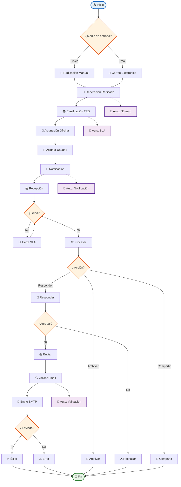

# Diagrama Simplificado - Sistema de Correspondencia

## 🎯 **OPCIÓN 2: Versión Simplificada (Más fácil de modificar)**



## 🎨 **VENTAJAS DE ESTA VERSIÓN:**

### **✅ MÁS SIMPLE:**
- Menos elementos
- Flujo más claro
- Fácil de modificar

### **✅ MANTIENE LO ESENCIAL:**
- Funciones transversales
- Procesos automáticos
- Flujo completo

### **✅ FÁCIL DE PERSONALIZAR:**
- Textos más cortos
- Menos decisiones
- Estructura clara

## 🔧 **CÓMO MODIFICAR:**

### **1. Cambiar textos:**
```mermaid
MANUAL[👤 Tu texto aquí]
```

### **2. Agregar elementos:**
```mermaid
NUEVO[📝 Nuevo proceso]
ACCION --> NUEVO
NUEVO --> FIN
```

### **3. Cambiar colores:**
```mermaid
style NUEVO fill:#tu_color,stroke:#tu_borde,stroke-width:2px
```

### **4. Agregar decisiones:**
```mermaid
NUEVO{¿Nueva decisión?}
NUEVO -->|Sí| PROCESO1
NUEVO -->|No| PROCESO2
```

¿Te gusta más esta versión simplificada? ¿Quieres que la modifique de alguna manera específica? 🎯


