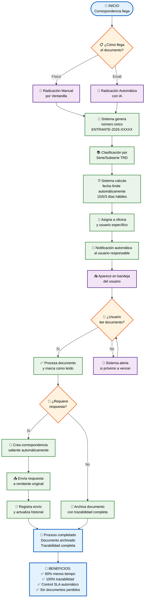
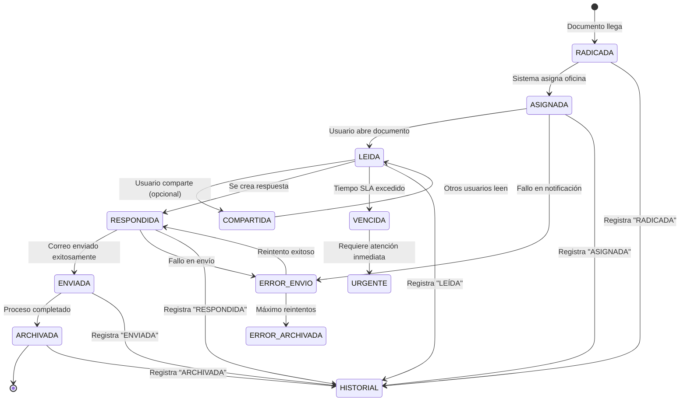
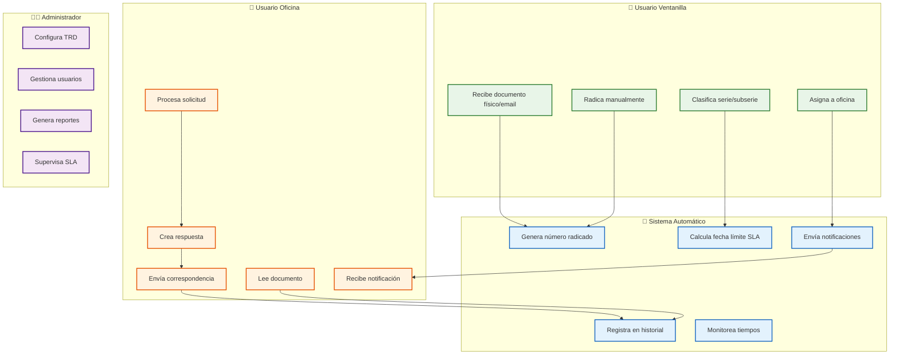

# 🎨 DIAGRAMA DE FLUJO MEJORADO - Sistema de Gestión de Correspondencia

## 📊 VERSIÓN COMPLETA (Para documentación técnica)

```mermaid
graph TD
    %% ========== PUNTOS DE INICIO ==========
    START1([📥 Inicio - Radicación Manual]) 
    START2([📧 Inicio - Correo Electrónico])
    
    %% ========== FLUJO DE RADICACIÓN MANUAL ==========
    START1 --> MANUAL[📋 Radicación Manual<br/>usando formulario]
    MANUAL --> GENERATE1[🔢 Sistema genera<br/>número radicado automático<br/>ENTRANTE-2025-XXXXX]
    
    %% ========== FLUJO DE CORREO ELECTRÓNICO ==========
    START2 --> EMAIL[📨 Llegada de correo<br/>electrónico]
    EMAIL --> IMAP[🔌 Protocolo IMAP<br/>captura correo]
    IMAP --> STORE[💾 Almacena en<br/>CorreoEntrante]
    STORE --> CLASSIFY{🤖 ¿Clasificación<br/>IA disponible?}
    
    CLASSIFY -->|Sí| AI_CLASSIFY[🧠 IA clasifica:<br/>- Tipo documento<br/>- Oficina destino<br/>- Urgencia]
    CLASSIFY -->|No| MANUAL_CLASSIFY[👤 Usuario revisa<br/>y clasifica manualmente]
    
    AI_CLASSIFY --> GENERATE2[🔢 Sistema genera<br/>número radicado automático<br/>ENTRANTE-2025-XXXXX]
    MANUAL_CLASSIFY --> GENERATE2
    
    %% ========== CONVERGENCIA DE FLUJOS ==========
    GENERATE1 --> ASSIGN_SERIE[📚 Asignación manual de<br/>serie y subserie documental]
    GENERATE2 --> ASSIGN_SERIE
    
    ASSIGN_SERIE --> TRAMITE_TYPE[📋 Clasificación tipo<br/>de trámite]
    TRAMITE_TYPE --> SLA_CALC{⏰ ¿Tipo de<br/>trámite urgente?}
    
    SLA_CALC -->|Normal| SLA_NORMAL[⏰ 15 días hábiles<br/>para respuesta]
    SLA_CALC -->|Urgente| SLA_URGENT[⏰ 5 días hábiles<br/>para respuesta]
    SLA_CALC -->|Muy Urgente| SLA_CRITICAL[⏰ 3 días hábiles<br/>para respuesta]
    
    SLA_NORMAL --> ASSIGN_OFFICE[🏢 Asigna a oficina<br/>productora]
    SLA_URGENT --> ASSIGN_OFFICE
    SLA_CRITICAL --> ASSIGN_OFFICE
    
    ASSIGN_OFFICE --> ASSIGN_USER[👤 Asigna a usuario<br/>específico de oficina]
    
    %% ========== HISTORIAL Y NOTIFICACIÓN ==========
    ASSIGN_USER --> HISTORIAL1[📝 Registra en<br/>HistorialCorrespondencia:<br/>"RADICADA"]
    
    HISTORIAL1 --> NOTIFY[🔔 Notificación automática<br/>al usuario asignado]
    NOTIFY --> RECEIVE[📥 Usuario recibe<br/>correspondencia en bandeja]
    
    %% ========== PROCESAMIENTO POR USUARIO ==========
    RECEIVE --> READ{👀 ¿Usuario abre<br/>documento?}
    
    READ -->|Sí| MARK_READ[✅ Marca como leído]
    READ -->|No| WAIT[⏳ Espera lectura]
    
    MARK_READ --> HISTORIAL2[📝 Registra en historial:<br/>"LEÍDA"]
    
    %% ========== DECISIONES POST-LECTURA ==========
    HISTORIAL2 --> SHARE_DECISION{🤝 ¿Requiere compartir<br/>con otros usuarios?}
    
    SHARE_DECISION -->|Sí| SHARE[📤 Compartir correspondencia<br/>con oficina/usuarios]
    SHARE_DECISION -->|No| RESPONSE_DECISION{💬 ¿Requiere<br/>respuesta?}
    
    SHARE --> HISTORIAL3[📝 Registra en historial:<br/>"COMPARTIDA"]
    HISTORIAL3 --> RESPONSE_DECISION
    
    %% ========== GESTIÓN DE CONTACTOS ==========
    RESPONSE_DECISION -->|Sí| CONTACT_CHECK{👥 ¿Contacto externo<br/>existe?}
    RESPONSE_DECISION -->|No| ARCHIVE[📁 Archivar documento]
    
    CONTACT_CHECK -->|No| CREATE_ENTITY[🏢 Crear entidad externa]
    CONTACT_CHECK -->|Sí| CREATE_CONTACT[👤 Crear contacto externo<br/>asociado a entidad]
    
    CREATE_ENTITY --> CREATE_CONTACT
    CREATE_CONTACT --> CONTACT_READY[✅ Contacto listo<br/>para correspondencia]
    
    %% ========== CORRESPONDENCIA SALIENTE ==========
    CONTACT_READY --> RESPONSE_TYPE{📤 ¿Tipo de<br/>respuesta?}
    
    RESPONSE_TYPE -->|Individual| SINGLE_RESPONSE[📝 Crear respuesta<br/>individual]
    RESPONSE_TYPE -->|Masiva| MASS_RESPONSE[📢 Crear comunicación<br/>masiva con grupos]
    
    SINGLE_RESPONSE --> APPROVAL{✅ ¿Requiere<br/>aprobación?}
    MASS_RESPONSE --> APPROVAL
    
    APPROVAL -->|Sí| APPROVE[👨‍💼 Jefe aprueba<br/>correspondencia]
    APPROVAL -->|No| SEND_EMAIL[📧 Enviar correo<br/>electrónico]
    
    APPROVE --> SEND_EMAIL
    
    %% ========== CONTROL DE ENVÍO ==========
    SEND_EMAIL --> SEND_CHECK{📤 ¿Envío<br/>exitoso?}
    
    SEND_CHECK -->|Sí| SUCCESS[✅ Correspondencia<br/>enviada exitosamente]
    SEND_CHECK -->|No| ERROR[❌ Error en envío:<br/>rebotes o fallos]
    
    SUCCESS --> HISTORIAL4[📝 Registra en historial:<br/>"ENVIADA"]
    ERROR --> ERROR_HANDLING[🔧 Manejo de errores:<br/>- Reintentar envío<br/>- Notificar remitente<br/>- Registrar error]
    
    ERROR_HANDLING --> RETRY{🔄 ¿Reintentar<br/>envío?}
    RETRY -->|Sí| SEND_EMAIL
    RETRY -->|No| ERROR_ARCHIVE[📁 Archivar con<br/>estado error]
    
    %% ========== FINALIZACIÓN ==========
    HISTORIAL4 --> FINAL[🏁 Correspondencia<br/>completada y archivada]
    ARCHIVE --> FINAL
    ERROR_ARCHIVE --> FINAL
    
    %% ========== FUNCIONES ADICIONALES ==========
    WAIT --> SLA_ALERT{⏰ ¿Próximo a<br/>vencer?}
    SLA_ALERT -->|Sí| ALERT[🚨 Alerta automática:<br/>Documento próximo a vencer]
    SLA_ALERT -->|No| RECEIVE
    ALERT --> RECEIVE
    
    %% ========== ESTILOS ==========
    classDef startEnd fill:#e1f5fe,stroke:#01579b,stroke-width:3px,color:#000
    classDef process fill:#f3e5f5,stroke:#4a148c,stroke-width:2px,color:#000
    classDef decision fill:#fff3e0,stroke:#e65100,stroke-width:2px,color:#000
    classDef success fill:#e8f5e8,stroke:#2e7d32,stroke-width:2px,color:#000
    classDef error fill:#ffebee,stroke:#c62828,stroke-width:2px,color:#000
    classDef system fill:#e3f2fd,stroke:#1565c0,stroke-width:2px,color:#000
    
    class START1,START2,FINAL startEnd
    class MANUAL,EMAIL,IMAP,STORE,ASSIGN_SERIE,TRAMITE_TYPE,ASSIGN_OFFICE,ASSIGN_USER,NOTIFY,RECEIVE,MARK_READ,SHARE,CREATE_ENTITY,CREATE_CONTACT,SINGLE_RESPONSE,MASS_RESPONSE,APPROVE,SEND_EMAIL,SUCCESS,ERROR_HANDLING,ARCHIVE,ALERT process
    class CLASSIFY,SLA_CALC,READ,SHARE_DECISION,RESPONSE_DECISION,CONTACT_CHECK,RESPONSE_TYPE,APPROVAL,SEND_CHECK,RETRY,SLA_ALERT decision
    class HISTORIAL1,HISTORIAL2,HISTORIAL3,HISTORIAL4,CONTACT_READY success
    class ERROR,ERROR_ARCHIVE error
    class GENERATE1,GENERATE2,AI_CLASSIFY,SLA_NORMAL,SLA_URGENT,SLA_CRITICAL,HISTORIAL1,HISTORIAL2,HISTORIAL3,HISTORIAL4 system
```

---

## 🎯 VERSIÓN SIMPLIFICADA (Para presentación a directivos)



---

## 📊 DIAGRAMA DE ESTADOS (Complementario)



---

## 🎨 DIAGRAMA DE ROLES (Swimlanes)



---

## 💡 CÓMO USAR ESTOS DIAGRAMAS

### **Para tu presentación a directivos:**

1. **Slide inicial:** Versión simplificada (2do diagrama)
2. **Demo en vivo:** Menciona cada paso mientras navegas
3. **Preguntas técnicas:** Versión completa (1er diagrama)
4. **Estados del sistema:** Diagrama de estados (3er diagrama)

### **Para documentación técnica:**

1. **Desarrollo:** Versión completa con todos los detalles
2. **Testing:** Diagrama de estados para casos de prueba
3. **Capacitación:** Diagrama de roles para explicar permisos

### **Colores y significado:**

- 🔵 **Azul:** Procesos automáticos del sistema
- 🟠 **Naranja:** Decisiones humanas
- 🟢 **Verde:** Resultados exitosos
- 🔴 **Rojo:** Errores y excepciones
- 🟣 **Morado:** Roles y responsabilidades

---

## 🚀 PRÓXIMOS PASOS

1. **Elige el diagrama** que más te guste para la presentación
2. **Personaliza** los colores con tu marca corporativa
3. **Practica** explicando cada paso
4. **Prepara** ejemplos específicos del hospital

**¿Cuál de estos diagramas prefieres para tu presentación? ¿Necesitas que ajuste algo específico?** 🎨
