# Diagrama de Flujo Normal - Sistema de Correspondencia

## 📋 **Diagrama Principal con Funciones Transversales**

```mermaid
flowchart TD
    %% ===== ENTRADA DE DOCUMENTOS =====
    START([📥 Inicio del Proceso])
    
    %% Medios de entrada
    START --> ENTRADA{¿Medio de entrada?}
    ENTRADA -->|Documento Físico| RADICACION_MANUAL[👤 Radicación Manual<br/>Formulario radicar_correspondencia.html]
    ENTRADA -->|Correo Electrónico| CORREO_ENTRADA[📧 Llegada de Correo Electrónico]
    
    %% ===== PROCESAMIENTO INICIAL =====
    RADICACION_MANUAL --> GENERACION_RADICADO[🔢 Generación de Radicado<br/>ENTRANTE-2025-XXXXX<br/>Según Ley xxx 20xx]
    CORREO_ENTRADA --> PROTOCOLO_IMAP[📨 Protocolo IMAP<br/>Lectura de Bandeja]
    PROTOCOLO_IMAP --> GENERACION_RADICADO
    
    %% ===== CLASIFICACIÓN DOCUMENTAL =====
    GENERACION_RADICADO --> ASIGNACION_SERIE[📚 Asignación Manual de Serie<br/>y Subserie Documental]
    ASIGNACION_SERIE --> CLASIFICACION_TRAMITE[📋 Clasificación Tipo de Trámite]
    CLASIFICACION_TRAMITE --> TIEMPO_TRAMITE[⏰ Clasificación de Tiempo de Trámite<br/>por Subserie Seleccionada]
    
    %% ===== CÁLCULO AUTOMÁTICO SLA =====
    TIEMPO_TRAMITE --> CALCULO_SLA[⏱️ Cálculo Automático SLA<br/>Fecha Límite Respuesta<br/>Considerando Calendario Laboral]
    
    %% ===== DISTRIBUCIÓN INICIAL =====
    CALCULO_SLA --> ASIGNACION_OFICINA[🏢 Objeto Correspondencia<br/>Asignado a Oficina]
    ASIGNACION_OFICINA --> ASIGNACION_USUARIO{¿Asignar usuario específico?}
    ASIGNACION_USUARIO -->|Sí| ASIGNAR_USUARIO[👤 Asignar a Usuario<br/>de Oficina]
    ASIGNACION_USUARIO -->|No| SOLO_OFICINA[🏢 Solo Asignación<br/>a Oficina]
    
    %% ===== NOTIFICACIONES AUTOMÁTICAS =====
    ASIGNAR_USUARIO --> NOTIFICACION_CORRESPONDENCIA[🔔 Notificación de Correspondencia<br/>Email/Sistema]
    SOLO_OFICINA --> NOTIFICACION_CORRESPONDENCIA
    
    %% ===== RECEPCIÓN Y LECTURA =====
    NOTIFICACION_CORRESPONDENCIA --> RECEPCION_CORRESPONDENCIA[📥 Recepción de Correspondencia<br/>Bandeja Personal/Oficina]
    RECEPCION_CORRESPONDENCIA --> LECTURA_USUARIO{👀 ¿Usuario lee correspondencia?}
    LECTURA_USUARIO -->|No| ALERTA_SLA[🚨 Alerta SLA<br/>Próximo a Vencer<br/>Notificación Automática]
    LECTURA_USUARIO -->|Sí| MARCADO_LEIDO[✅ Marcado como Leído<br/>por Usuario<br/>Registro en Historial]
    
    ALERTA_SLA --> LECTURA_USUARIO
    
    %% ===== PROCESAMIENTO Y ACCIONES =====
    MARCADO_LEIDO --> ACCIONES_DISPONIBLES{📋 ¿Qué acción realizar?}
    
    %% Opciones de procesamiento
    ACCIONES_DISPONIBLES -->|Compartir| COMPARTIR_OFICINA[🔄 Compartir Correspondencia<br/>con Oficina]
    ACCIONES_DISPONIBLES -->|Redistribuir| REDISTRIBUCION_INTERNA[↔️ Redistribución Interna<br/>Reasignar a Otro Usuario]
    ACCIONES_DISPONIBLES -->|Responder| RESPONDER_CONTACTO[💬 Responder Correspondencia<br/>a Contacto Externo Remitente]
    ACCIONES_DISPONIBLES -->|Solo leer| LECTURA_OFICINA[📁 Leída por Oficina<br/>Archivar Sin Respuesta]
    
    %% ===== COMPARTIR Y REDISTRIBUIR =====
    COMPARTIR_OFICINA --> LECTURA_OFICINA_COMPARTIDA[👥 Leída por Oficina<br/>Compartida]
    REDISTRIBUCION_INTERNA --> NUEVA_ASIGNACION_USUARIO[👤 Nueva Asignación<br/>a Usuario Específico]
    NUEVA_ASIGNACION_USUARIO --> NOTIFICACION_CORRESPONDENCIA
    
    %% ===== FLUJO DE RESPUESTA =====
    RESPONDER_CONTACTO --> CREACION_BORRADOR[📝 Creación de Borrador<br/>Correspondencia de Salida]
    CREACION_BORRADOR --> REQUIERE_APROBACION{✅ ¿Requiere aprobación<br/>de supervisor?}
    REQUIERE_APROBACION -->|Sí| PENDIENTE_APROBACION[⏳ Pendiente Aprobación<br/>En Cola de Revisión]
    REQUIERE_APROBACION -->|No| APROBACION_ENVIO[📤 Aprobación de Envío<br/>Directo]
    
    %% Proceso de aprobación
    PENDIENTE_APROBACION --> REVISION_SUPERVISOR{👨‍💼 ¿Supervisor aprueba<br/>la respuesta?}
    REVISION_SUPERVISOR -->|Rechazar| RECHAZO_MOTIVO[❌ Rechazar con Motivo<br/>Registro en Historial]
    REVISION_SUPERVISOR -->|Aprobar| APROBACION_ENVIO
    
    %% ===== VALIDACIÓN Y ENVÍO =====
    APROBACION_ENVIO --> VALIDACION_EMAIL[🔍 Validación Email Destinatario<br/>MX Record/SMTP Check]
    VALIDACION_EMAIL --> ENVIO_CORREO[📧 Envío de Correo Electrónico<br/>Protocolo SMTP]
    ENVIO_CORREO --> SEGUIMIENTO_DSN[📊 Seguimiento DSN<br/>Delivery Status Notification]
    
    %% ===== RESULTADOS DE ENVÍO =====
    ENVIO_CORREO --> RESULTADO_ENVIO{📬 ¿Envío exitoso?}
    SEGUIMIENTO_DSN --> RESULTADO_ENVIO
    RESULTADO_ENVIO -->|Sí| CORRESPONDENCIA_SALIDA[✅ Correspondencia de Salida<br/>Enviada Exitosamente]
    RESULTADO_ENVIO -->|No| REBOTES_ERRORES[⚠️ Rebotes de Correspondencia<br/>Errores de Envío<br/>Registro de Detalles]
    
    %% ===== DETALLES Y CONTACTOS =====
    CORRESPONDENCIA_SALIDA --> DETALLE_CORRESPONDENCIA[📋 Detalle Correspondencia<br/>de Salida]
    REBOTES_ERRORES --> DETALLE_CORRESPONDENCIA
    DETALLE_CORRESPONDENCIA --> CREACION_CONTACTO[👤 Creación de Contacto<br/>Externo por Oficina]
    
    %% ===== GESTIÓN DE ENTIDADES EXTERNAS =====
    CREACION_CONTACTO --> CREACION_ENTIDAD[🏢 Creación de Entidad Externa<br/>Empresa/Institución]
    CREACION_ENTIDAD --> CONTACTO_ASOCIADO[👤 Creación de Contacto Externo<br/>Asociado a Entidad Externa<br/>Gestión desde Ventanilla]
    CONTACTO_ASOCIADO --> ENVIO_CORREO
    
    %% ===== CATÁLOGO DE CONTACTOS =====
    RESPONDER_CONTACTO --> CATALOGO_CONTACTOS[📚 Creación de Catálogo<br/>de Contactos<br/>Grupos Preseleccionados<br/>para Agilizar Respuestas]
    CATALOGO_CONTACTOS --> CONTACTO_ASOCIADO
    
    %% ===== HISTORIAL Y TRAZABILIDAD =====
    CORRESPONDENCIA_SALIDA --> ACTUALIZAR_HISTORIAL[📋 Actualizar Historial<br/>Correspondencia]
    REBOTES_ERRORES --> ACTUALIZAR_HISTORIAL
    LECTURA_OFICINA --> ACTUALIZAR_HISTORIAL
    RECHAZO_MOTIVO --> ACTUALIZAR_HISTORIAL
    LECTURA_OFICINA_COMPARTIDA --> ACTUALIZAR_HISTORIAL
    
    ACTUALIZAR_HISTORIAL --> FIN([🏁 Fin del Proceso])
    
    %% ===== FUNCIONES TRANSVERSALES AUTOMÁTICAS =====
    
    %% Generación automática de radicados
    GENERACION_RADICADO -.->|Automático| AUTO_GENERACION[🤖 Generación Automática<br/>Número Radicado<br/>ENTRANTE-2025-XXXXX<br/>Según Ley xxx 20xx]
    
    %% Cálculo automático de SLA
    CALCULO_SLA -.->|Automático| AUTO_SLA[🤖 Cálculo Automático SLA<br/>Fecha Límite Respuesta<br/>Considerando Calendario Laboral<br/>Feriados y Días Hábiles]
    
    %% Notificaciones automáticas
    NOTIFICACION_CORRESPONDENCIA -.->|Automático| AUTO_NOTIFICACION[🤖 Notificación Automática<br/>Email/Sistema<br/>Múltiples Canales<br/>Configuración por Usuario]
    
    %% Historial y trazabilidad automática
    ACTUALIZAR_HISTORIAL -.->|Automático| AUTO_HISTORIAL[🤖 Registro Automático<br/>Historial Completo<br/>Trazabilidad Total<br/>Auditoría de Cambios]
    
    %% Validación automática de emails
    VALIDACION_EMAIL -.->|Automático| AUTO_VALIDACION[🤖 Validación Automática<br/>Email MX Record<br/>SMTP Check<br/>API Validation]
    
    %% Snapshots automáticos
    CREACION_BORRADOR -.->|Automático| AUTO_SNAPSHOTS[🤖 Snapshots Automáticos<br/>Oficina Emisora<br/>Datos del Redactor<br/>Información del Destinatario]
    
    %% Cálculo de métricas
    ACTUALIZAR_HISTORIAL -.->|Automático| AUTO_METRICAS[🤖 Cálculo Automático<br/>Métricas de Rendimiento<br/>Tiempos de Respuesta<br/>Estadísticas por Oficina]
    
    %% ===== ESTILOS Y COLORES =====
    
    %% Elementos principales
    style START fill:#e3f2fd,stroke:#1565c0,stroke-width:3px
    style FIN fill:#e8f5e8,stroke:#2e7d32,stroke-width:3px
    
    %% Funciones automáticas transversales
    style AUTO_GENERACION fill:#f3e5f5,stroke:#4a148c,stroke-width:2px
    style AUTO_SLA fill:#f3e5f5,stroke:#4a148c,stroke-width:2px
    style AUTO_NOTIFICACION fill:#f3e5f5,stroke:#4a148c,stroke-width:2px
    style AUTO_HISTORIAL fill:#f3e5f5,stroke:#4a148c,stroke-width:2px
    style AUTO_VALIDACION fill:#f3e5f5,stroke:#4a148c,stroke-width:2px
    style AUTO_SNAPSHOTS fill:#f3e5f5,stroke:#4a148c,stroke-width:2px
    style AUTO_METRICAS fill:#f3e5f5,stroke:#4a148c,stroke-width:2px
    
    %% Puntos de decisión
    style ENTRADA fill:#fff3e0,stroke:#e65100,stroke-width:2px
    style ASIGNACION_USUARIO fill:#fff3e0,stroke:#e65100,stroke-width:2px
    style LECTURA_USUARIO fill:#fff3e0,stroke:#e65100,stroke-width:2px
    style ACCIONES_DISPONIBLES fill:#fff3e0,stroke:#e65100,stroke-width:2px
    style REQUIERE_APROBACION fill:#fff3e0,stroke:#e65100,stroke-width:2px
    style REVISION_SUPERVISOR fill:#fff3e0,stroke:#e65100,stroke-width:2px
    style RESULTADO_ENVIO fill:#fff3e0,stroke:#e65100,stroke-width:2px
    
    %% Procesos críticos
    style GENERACION_RADICADO fill:#e8f5e8,stroke:#2e7d32,stroke-width:2px
    style CALCULO_SLA fill:#e8f5e8,stroke:#2e7d32,stroke-width:2px
    style ENVIO_CORREO fill:#e8f5e8,stroke:#2e7d32,stroke-width:2px
    
    %% Estados de error
    style REBOTES_ERRORES fill:#ffebee,stroke:#c62828,stroke-width:2px
    style RECHAZO_MOTIVO fill:#ffebee,stroke:#c62828,stroke-width:2px
    style ALERTA_SLA fill:#fff8e1,stroke:#f57c00,stroke-width:2px
```

## 📋 **DESCRIPCIÓN DE FUNCIONES TRANSVERSALES**

### **🤖 FUNCIONES AUTOMÁTICAS PRINCIPALES:**

#### **1. Generación Automática de Radicados**
- **Función:** Crea números únicos automáticamente
- **Formato:** ENTRANTE-2025-XXXXX
- **Activación:** Al crear nueva correspondencia
- **Ley aplicada:** xxx 20xx

#### **2. Cálculo Automático de SLA**
- **Función:** Calcula fechas límite de respuesta
- **Considera:** Calendario laboral, feriados, días hábiles
- **Fuentes:** TRD, configuración por subserie
- **Persistencia:** Guarda cálculo para reportes

#### **3. Notificaciones Automáticas**
- **Función:** Envía alertas automáticas
- **Canales:** Email, sistema interno
- **Eventos:** Nueva asignación, vencimientos, alertas
- **Configuración:** Por usuario y preferencias

#### **4. Historial y Trazabilidad**
- **Función:** Registra todos los cambios
- **Alcance:** Estados, usuarios, fechas, motivos
- **Auditoría:** Trazabilidad completa
- **Reportes:** Historial detallado por correspondencia

#### **5. Validación Automática de Emails**
- **Función:** Valida direcciones antes del envío
- **Métodos:** MX Record, SMTP Check, API Validation
- **Prevención:** Evita rebotes y errores
- **Configuración:** Múltiples proveedores

#### **6. Snapshots Automáticos**
- **Función:** Captura datos al momento del envío
- **Datos:** Oficina emisora, redactor, destinatario
- **Propósito:** Trazabilidad histórica
- **Inmutabilidad:** Datos no cambian después

#### **7. Cálculo de Métricas**
- **Función:** Genera estadísticas automáticas
- **Métricas:** Tiempos de respuesta, volúmenes
- **Agrupación:** Por oficina, usuario, período
- **Reportes:** Dashboards y análisis

### **📊 FUNCIONES SECUNDARIAS:**

#### **Gestión de Contactos**
- Creación automática de contactos
- Validación de datos
- Asociación con entidades externas

#### **Gestión de Entidades Externas**
- Registro de empresas/instituciones
- Validación de NIT y datos fiscales
- Asociación con dominios de email

#### **Gestión de Grupos**
- Creación de catálogos de contactos
- Grupos preseleccionados
- Envíos masivos controlados

#### **Seguimiento de Envíos**
- Tracking de DSN (Delivery Status Notification)
- Manejo de rebotes
- Registro de errores detallados

## 🎯 **CARACTERÍSTICAS DEL DIAGRAMA:**

### **✅ COMPLETITUD:**
- Incluye todas las funciones transversales
- Muestra procesos automáticos
- Cubre flujo completo de entrada a salida

### **✅ CLARIDAD:**
- Funciones automáticas con líneas punteadas
- Colores consistentes por tipo de proceso
- Textos descriptivos y técnicos

### **✅ TRAZABILIDAD:**
- Historial completo de cambios
- Snapshots automáticos
- Validaciones en cada paso

### **✅ ROBUSTEZ:**
- Manejo de errores
- Validaciones automáticas
- Notificaciones proactivas

Este diagrama representa el flujo completo del sistema con todas las funciones transversales y secundarias implementadas en tu código. 🚀

