# FLUJOGRAMA MEJORADO - SISTEMA DE CORRESPONDENCIA HOSPITALARIA
## Con Fundamentación Jurídica Colombiana

**Versión:** 2.0 - Octubre 2025  
**Estado:** Propuesta de Mejora

---

## 🎯 CAMBIOS PRINCIPALES RESPECTO A LA VERSIÓN ANTERIOR

### ✅ Elementos Agregados:

1. **Digitalización obligatoria** de correspondencia física (Decreto 2609/2012)
2. **Acuse de recibo automático** al ciudadano (Ley 1755/2015 Art. 14)
3. **Clasificación específica de PQRSDF** (Petición, Queja, Reclamo, etc.)
4. **Verificación de competencia** de la entidad (Ley 1437/2011 Art. 13)
5. **Clasificación de confidencialidad** de datos sensibles (Ley 1581/2012)
6. **Solicitud de información adicional** (Ley 1755/2015 Art. 16)
7. **Prórroga de términos** (Ley 1755/2015 Art. 17)
8. **Firma digital** de respuestas oficiales (Ley 527/1999, Decreto 1074/2015)
9. **Sello digital de tiempo** (Acuerdo AGN 003/2015)
10. **Notificación multicanal** con canales alternativos (Ley 1437/2011 Art. 69)
11. **Ciclo de vida documental completo** (Acuerdo AGN 060/2001)
12. **Traslado a entidad competente** cuando aplique
13. **Alertas SLA progresivas** (75%, 90%, 95%, 100%)
14. **Gestión de reintentos** en envío de emails

---

## 📊 FLUJOGRAMA COMPLETO

```mermaid
flowchart TD
    %% ENTRADA
    A[📥 Inicio] --> B{¿Medio de entrada?}
    B -->|Físico| C[👤 Radicación Manual<br/>formulario radicar_correspondencia.html]
    B -->|Email| D[📧 Llegada de Correo Electrónico]
    
    %% DIGITALIZACIÓN (NUEVO)
    C --> C1[📸 Digitalización Obligatoria<br/>📜 Decreto 2609 de 2012]
    C1 --> C2[🔍 OCR - Reconocimiento de Texto<br/>Búsqueda Indexada]
    C2 --> C3[💾 Almacenamiento Digital Certificado]
    C3 --> E
    
    %% PROCESAMIENTO EMAIL
    D --> F[📨 Protocolo IMAP<br/>Captura Automática]
    F --> E
    
    %% GENERACIÓN RADICADO
    E[🔢 Generación Radicado ENTRANTE<br/>ENTRANTE-2025-XXXXX<br/>📜 Ley 1755 de 2015, Art. 14<br/>📜 Resolución 310 de 2011 SNS<br/>📜 Ley 594 de 2000, Art. 12]
    
    %% ACUSE DE RECIBO (NUEVO)
    E --> E1[📧 Envío Acuse de Recibo Automático<br/>al Ciudadano<br/>Incluye: Radicado, Fecha, Plazo, Link Consulta<br/>📜 Ley 1755/2015 Art. 14]
    
    %% CLASIFICACIÓN DOCUMENTAL
    E1 --> G[📚 Asignación Manual<br/>Serie y Subserie Documental<br/>📜 Acuerdo AGN 060 de 2001<br/>📜 Ley 594 de 2000, Art. 21]
    
    %% CLASIFICACIÓN PQRSDF (NUEVO)
    G --> G1{¿Es PQRSDF?}
    G1 -->|SÍ| G2[🏷️ Clasificar Tipo PQRSDF<br/>Petición / Queja / Reclamo<br/>Sugerencia / Denuncia / Felicitación<br/>📜 Ley 1755/2015]
    G1 -->|NO| H
    G2 --> H
    
    %% CLASIFICACIÓN TRÁMITE
    H[📋 Clasificación Tipo de Trámite<br/>Normal / Urgente / Muy Urgente]
    
    %% VERIFICACIÓN COMPETENCIA (NUEVO)
    H --> H1{¿Es competente<br/>la entidad?}
    H1 -->|NO| H2[📤 Trasladar a Entidad Competente<br/>📜 Ley 1437 de 2011, Art. 13 Parágrafo 2<br/>Plazo: 5 días hábiles]
    H2 --> H3[📧 Notificar al Ciudadano<br/>Información de traslado]
    H3 --> H4[📋 Registrar en Historial<br/>Estado: TRASLADADA]
    H4 --> ZFIN[🏁 Fin - Trasladada]
    H1 -->|SÍ| I
    
    %% CLASIFICACIÓN CONFIDENCIALIDAD (NUEVO)
    I[🔒 Clasificar Nivel de Confidencialidad<br/>📜 Ley 1581 de 2012 - Protección Datos Personales<br/>📜 Ley 23 de 1981, Art. 34 - Historia Clínica]
    I --> I1{¿Contiene datos<br/>sensibles de salud?}
    I1 -->|SÍ| I2[🔐 Marcar como CONFIDENCIAL<br/>Aplicar restricciones de acceso<br/>Control RBAC - Solo personal autorizado]
    I1 -->|NO| I3{¿Contiene datos<br/>personales?}
    I3 -->|SÍ| I4[🟡 Marcar como RESERVADO<br/>Aplicar controles de protección]
    I3 -->|NO| I5[🟢 Marcar como PÚBLICO]
    I2 --> J
    I4 --> J
    I5 --> J
    
    %% CÁLCULO SLA
    J[⏰ Clasificación Tiempo Trámite<br/>por Subserie + Tipo PQRSDF + SLA<br/>📜 Ley 1755/2015: Info=10d, Petición=15d<br/>📜 Ley 1437/2011: Consulta=30d<br/>📜 Ley 1581/2012: Habeas Data=15d]
    
    %% DISTRIBUCIÓN
    J --> K[🏢 Objeto Correspondencia<br/>Asignado a Oficina Productora]
    K --> L{¿Asignar a<br/>usuario específico?}
    L -->|Sí| M[👤 Asignar a Usuario<br/>de Oficina]
    L -->|No| N[🏢 Solo a Oficina<br/>Bandeja compartida]
    
    %% NOTIFICACIONES
    M --> O[🔔 Notificación de Correspondencia<br/>Email + Sistema Interno<br/>📜 Ley 1437/2011, Art. 67]
    N --> O
    
    %% RECEPCIÓN Y LECTURA
    O --> P[📥 Recepción de Correspondencia<br/>Bandeja Personal / Bandeja Oficina]
    P --> Q{👀 ¿Usuario lee?}
    
    %% ALERTAS SLA PROGRESIVAS (MEJORADO)
    Q -->|No| Q1[🚨 Sistema de Alertas SLA Progresivas<br/>🟢 75% tiempo: Recordatorio suave<br/>🟡 90% tiempo: Alerta importante<br/>🟠 95% tiempo: Alerta crítica + Copia supervisor<br/>🔴 100% tiempo: VENCIDO + Escalamiento automático<br/>📜 Ley 1755/2015 - Términos obligatorios]
    Q1 --> Q
    Q -->|Sí| R[✅ Marcado como Leído por Usuario<br/>Registro en Historial]
    
    %% VERIFICACIÓN INFORMACIÓN COMPLETA (NUEVO)
    R --> R1{¿La información<br/>recibida es completa?}
    R1 -->|NO| R2[📝 Solicitar Información Adicional<br/>al Ciudadano<br/>📜 Ley 1755 de 2015, Art. 16]
    R2 --> R3[⏸️ Suspender Término<br/>Máximo 10 días hábiles<br/>Contador SLA pausado]
    R3 --> R4[📧 Notificar al Ciudadano<br/>Detalle de información faltante]
    R4 --> R5{¿Ciudadano<br/>responde a tiempo?}
    R5 -->|NO| R6[❌ Rechazar Solicitud<br/>por Información Incompleta<br/>Notificar motivo]
    R6 --> HIST
    R5 -->|SÍ| R7[▶️ Reanudar Término<br/>Contador SLA continúa]
    R7 --> R1
    R1 -->|SÍ| S
    
    %% PROCESAMIENTO Y ACCIONES
    S{📋 ¿Qué acción realizar?}
    
    %% ACCIONES POSIBLES
    S -->|Compartir| T[🔄 Compartir Correspondencia<br/>con otra Oficina<br/>Copia informativa]
    S -->|Redistribuir| U[↔️ Redistribución Interna<br/>Reasignar a otro Usuario<br/>misma oficina]
    S -->|Responder| V[💬 Elaborar Respuesta<br/>a Contacto Externo]
    S -->|Solo leer| W[📁 Leída por Oficina<br/>Archivar sin respuesta]
    
    %% COMPARTIR Y REDISTRIBUIR
    T --> X[👥 Leída por múltiples Oficinas<br/>Registro colaborativo]
    X --> HIST
    U --> Y[👤 Nueva Asignación Usuario<br/>Notificación]
    Y --> O
    W --> HIST
    
    %% FLUJO DE RESPUESTA
    V --> V1{¿Requiere prórroga<br/>del término?}
    V1 -->|SÍ| V2[⏰ Solicitar Prórroga<br/>Justificación de motivo<br/>📜 Ley 1755 de 2015, Art. 17]
    V2 --> V3[📧 Notificar al Ciudadano<br/>Motivo y nuevo plazo<br/>Obligatorio antes del vencimiento]
    V3 --> V4[✅ Ampliar Plazo<br/>Registrar en Historial]
    V4 --> Z
    V1 -->|NO| Z
    
    %% CREACIÓN BORRADOR
    Z[📝 Crear Borrador Respuesta<br/>Redacción por funcionario asignado]
    Z --> AA{✅ ¿Requiere aprobación?}
    AA -->|Sí| BB[⏳ Pendiente Aprobación<br/>Estado: PENDIENTE_APROBACION]
    AA -->|No| CC
    BB --> DD{👨‍💼 ¿Supervisor<br/>aprueba respuesta?}
    DD -->|Rechazar| EE[❌ Rechazar con Motivo<br/>Observaciones para corrección]
    DD -->|Aprobar| CC
    EE --> Z
    CC[📤 Respuesta Aprobada<br/>Estado: APROBADA]
    
    %% FIRMA DIGITAL (NUEVO)
    CC --> CC1[🔐 Firma Digital de Respuesta<br/>Funcionario Competente<br/>📜 Ley 527 de 1999, Art. 7 y 28<br/>📜 Decreto 1074 de 2015, Art. 2.2.2.48.1]
    CC1 --> CC2[🕐 Sello Digital de Tiempo<br/>Timestamp Certificado<br/>📜 Acuerdo AGN 003 de 2015]
    CC2 --> CC3[#️⃣ Cálculo Hash SHA-256<br/>Garantía de Integridad<br/>No repudio]
    CC3 --> FF
    
    %% ENVÍO
    FF[🔍 Validar Email Destinatario<br/>Verificación MX/SMTP/DNS]
    FF --> GG[📧 Envío de Correo Electrónico<br/>Servidor SMTP Institucional]
    GG --> HH[📊 Seguimiento DSN<br/>Delivery Status Notification<br/>RFC 3461]
    
    %% ESTADOS FINALES - GESTIÓN DE REBOTES (MEJORADO)
    HH --> II{📬 ¿Estado de entrega?}
    II -->|Error/Rebote| JJ[⚠️ Reintento 1<br/>+15 minutos]
    JJ --> JJ1{¿Éxito?}
    JJ1 -->|NO| JJ2[⚠️ Reintento 2<br/>+1 hora]
    JJ2 --> JJ3{¿Éxito?}
    JJ3 -->|NO| JJ4[⚠️ Reintento 3<br/>+4 horas]
    JJ4 --> JJ5{¿Éxito?}
    JJ5 -->|NO| JJ6[🚨 Activar Canal Alternativo<br/>📜 Ley 1437 de 2011, Art. 69<br/>1. Intentar SMS si hay celular<br/>2. Publicar en portal web<br/>3. Generar Acta notificación por aviso<br/>4. Sugerir correo certificado]
    JJ6 --> JJ7[📝 Registro de Fallo de Email<br/>Tabla: Rebotes de Correspondencia]
    JJ7 --> LL
    JJ5 -->|SÍ| KK
    JJ3 -->|SÍ| KK
    JJ1 -->|SÍ| KK
    II -->|Entregado| KK[✅ Correspondencia de Salida<br/>Enviada Exitosamente<br/>Estado: ENVIADA]
    
    %% DETALLES Y CONTACTOS
    KK --> LL[📋 Detalle Correspondencia de Salida<br/>Metadatos completos de envío]
    LL --> LL1[💾 Archivo Digital Certificado<br/>PDF firmado + Metadatos<br/>📜 Ley 594 de 2000, Art. 46<br/>Garantía de inalterabilidad]
    
    %% GESTIÓN DE CONTACTOS
    V --> PP[📚 Creación/Selección de<br/>Catálogo de Contactos<br/>Grupos Preseleccionados]
    PP --> MM[👤 Seleccionar/Crear Contacto Externo<br/>Asociado a Oficina]
    MM --> NN[🏢 Vincular/Crear Entidad Externa<br/>Organización del contacto]
    NN --> FF
    
    %% HISTORIAL Y TRAZABILIDAD
    LL1 --> HIST[📋 Actualizar Historial Correspondencia<br/>Registro completo de eventos<br/>📜 Ley 1712 de 2014, Art. 16 - Transparencia<br/>📜 Ley 594 de 2000, Art. 15 - Trazabilidad]
    
    %% CICLO DE VIDA DOCUMENTAL (NUEVO)
    HIST --> HIST1[🗂️ Gestión Ciclo de Vida Documental<br/>📜 Acuerdo AGN 060 de 2001<br/>Tabla de Retención Documental TRD]
    HIST1 --> HIST2{¿Estado de<br/>conservación?}
    HIST2 -->|Activo| HIST3[📁 Archivo de Gestión<br/>Oficina productora<br/>Tiempo según TRD]
    HIST2 -->|Cumple tiempo gestión| HIST4[📦 Transferencia Primaria<br/>a Archivo Central<br/>Tiempo según TRD]
    HIST4 --> HIST5{¿Disposición Final<br/>según TRD?}
    HIST5 -->|Conservación Total CT| HIST6[🏛️ Transferencia Secundaria<br/>Archivo Histórico Permanente]
    HIST5 -->|Eliminación E| HIST7[🗑️ Eliminación Certificada<br/>Acta de Comité de Archivo<br/>Autorización formal]
    HIST5 -->|Selección S| HIST8[🔍 Selección Documental<br/>Muestreo representativo]
    
    HIST6 --> RR[🏁 Fin]
    HIST7 --> RR
    HIST8 --> RR
    HIST3 --> RR
    
    %% FUNCIONES AUTOMÁTICAS TRANSVERSALES
    E -.-> SS[🤖 Generación Automática<br/>Número Radicado<br/>Consecutivo anual único<br/>📜 Ley 1755 de 2015, Art. 14<br/>📜 Resolución 310 de 2011 SNS]
    J -.-> TT[🤖 Cálculo Automático SLA<br/>Calendario Laboral + Feriados<br/>Exclusión sábados, domingos, festivos<br/>📜 Ley 1437 de 2011, Art. 30<br/>📜 Ley 51 de 1983 - Festivos]
    O -.-> UU[🤖 Notificación Automática<br/>Multicanal<br/>Email / SMS / Sistema Interno<br/>Portal Web / Push Notifications]
    HIST -.-> VV[🤖 Registro Automático<br/>Historial/Trazabilidad<br/>Metadatos mínimos obligatorios<br/>Usuario, Fecha/Hora, IP, Acción<br/>📜 Decreto 1080 de 2015, Art. 2.8.2.5.8]
    FF -.-> WW[🤖 Validación Automática<br/>Email MX/SMTP/DNS<br/>Verificación dominio válido<br/>Existencia buzón]
    LL1 -.-> XX[🤖 Backup Automático<br/>Incremental horario<br/>Completo diario<br/>Redundancia geográfica<br/>📜 Ley 594 de 2000 - Conservación]
    
    %% ESTILOS
    classDef nuevo fill:#90EE90,stroke:#006400,stroke-width:3px
    classDef critico fill:#FFB6C1,stroke:#8B0000,stroke-width:3px
    classDef legal fill:#87CEEB,stroke:#00008B,stroke-width:2px
    
    class C1,C2,C3,E1,G1,G2,H1,H2,H3,I,I1,I2,I3,I4,I5,R1,R2,R3,R4,R5,R6,R7,V1,V2,V3,V4,CC1,CC2,CC3,JJ6,JJ7,LL1,HIST1,HIST2,HIST4,HIST5,HIST6,HIST7,HIST8 nuevo
    class E,G,J,CC1,CC2,HIST critico
    class SS,TT,UU,VV,WW,XX legal
```

---

## 📋 TABLA DE NORMATIVA APLICADA

| # | Elemento del Flujograma | Norma Aplicable | Artículo | Descripción |
|---|------------------------|-----------------|----------|-------------|
| 1 | Radicación física y electrónica | Ley 594 de 2000 | Art. 22, 24 | Documentos son bienes de interés público |
| 2 | Digitalización obligatoria | Decreto 2609 de 2012 | Art. 9 | Digitalizar documentos en archivos |
| 3 | Generación radicado ENTRANTE | Ley 1755 de 2015 | Art. 14 | Radicación mismo día de recepción |
| 4 | Generación radicado (Salud) | Resolución 310 de 2011 SNS | Art. 2 | Radicación en entidades de salud |
| 5 | Acuse de recibo automático | Ley 1755 de 2015 | Art. 14 | Obligación de radicar y notificar |
| 6 | Serie y Subserie Documental | Acuerdo AGN 060 de 2001 | Art. 1, 3 | Tablas de Retención Documental |
| 7 | Organización documental | Ley 594 de 2000 | Art. 21 | Organización según TRD |
| 8 | Clasificación PQRSDF | Ley 1755 de 2015 | Todo | Derecho de Petición |
| 9 | Traslado a entidad competente | Ley 1437 de 2011 (CPACA) | Art. 13 §2 | Remitir a competente en 5 días |
| 10 | Protección datos personales | Ley 1581 de 2012 | Art. 4 | Principios de protección de datos |
| 11 | Historia clínica confidencial | Ley 23 de 1981 | Art. 34 | Historia clínica es privada |
| 12 | Plazo información pública | Ley 1755 de 2015 | Art. 14 | 10 días hábiles |
| 13 | Plazo petición general | Ley 1437 de 2011 | Art. 13 | 15 días hábiles |
| 14 | Plazo consulta técnica | Ley 1437 de 2011 | Art. 23 | 30 días hábiles |
| 15 | Plazo Habeas Data | Ley 1581 de 2012 | Art. 15 | 15 días hábiles |
| 16 | Solicitud info adicional | Ley 1755 de 2015 | Art. 16 | Suspensión máx 10 días |
| 17 | Prórroga excepcional | Ley 1755 de 2015 | Art. 17 | Circunstancias especiales |
| 18 | Notificaciones electrónicas | Ley 1437 de 2011 | Art. 67 | Con autorización del interesado |
| 19 | Firma digital | Ley 527 de 1999 | Art. 7, 28 | Validez jurídica firma digital |
| 20 | Reglamentación firma electrónica | Decreto 1074 de 2015 | Art. 2.2.2.48.1 | Uso en entidades públicas |
| 21 | Sello de tiempo | Acuerdo AGN 003 de 2015 | Todo | Lineamientos doc. electrónicos |
| 22 | Notificación alternativa | Ley 1437 de 2011 | Art. 69 | Correo o aviso si falla electrónico |
| 23 | Conservación documentos | Ley 594 de 2000 | Art. 46 | Mantener en buen estado |
| 24 | Transparencia y trazabilidad | Ley 1712 de 2014 | Art. 16 | Procedimientos claros de gestión |
| 25 | Metadatos mínimos | Decreto 1080 de 2015 | Art. 2.8.2.5.8 | Requisitos doc. electrónicos |
| 26 | Días hábiles | Ley 1437 de 2011 | Art. 30 | Términos en días hábiles |
| 27 | Festivos Colombia | Ley 51 de 1983 | Todo | Lista de días festivos |
| 28 | TRD y disposición final | Acuerdo AGN 060 de 2001 | Todo | Tiempos de conservación |

---

## 🔑 LEYENDA DE COLORES (en diagrama Mermaid)

- 🟢 **Verde (nuevo):** Elementos agregados en esta versión
- 🔴 **Rosa (critico):** Procesos críticos con alta carga normativa
- 🔵 **Azul (legal):** Funciones automáticas con base legal

---

## 📝 NOTAS DE IMPLEMENTACIÓN

### Prioridad 1 - Crítica (0-3 meses)

1. **Digitalización obligatoria**: Integrar escáner en proceso de radicación
2. **Acuse de recibo**: Template automático de email
3. **Firma digital**: Adquirir certificado digital institucional
4. **Clasificación PQRSDF**: Agregar campo al modelo

### Prioridad 2 - Alta (3-6 meses)

5. **Solicitud info adicional**: Crear flujo de suspensión/reanudación
6. **Prórroga**: Workflow de aprobación de prórrogas
7. **Protección datos**: Implementar RBAC granular
8. **Traslado competencia**: Directorio de entidades

### Prioridad 3 - Media (6-12 meses)

9. **Conservación documental**: Alertas automáticas de transferencia
10. **Canal multicanal**: Integración SMS y portal web
11. **Ciclo vida completo**: Procesos de transferencia y eliminación

---

## 🔗 REFERENCIAS NORMATIVAS COMPLETAS

### Leyes Principales

- **Ley 594 de 2000** - [Ley General de Archivos](https://www.funcionpublica.gov.co/eva/gestornormativo/norma.php?i=4275)
- **Ley 527 de 1999** - [Comercio Electrónico y Firma Digital](https://www.funcionpublica.gov.co/eva/gestornormativo/norma.php?i=4276)
- **Ley 1437 de 2011** - [Código de Procedimiento Administrativo](https://www.funcionpublica.gov.co/eva/gestornormativo/norma.php?i=41249)
- **Ley 1755 de 2015** - [Derecho de Petición](https://www.funcionpublica.gov.co/eva/gestornormativo/norma.php?i=62755)
- **Ley 1581 de 2012** - [Protección de Datos Personales](https://www.funcionpublica.gov.co/eva/gestornormativo/norma.php?i=49981)
- **Ley 1712 de 2014** - [Ley de Transparencia](https://www.funcionpublica.gov.co/eva/gestornormativo/norma.php?i=56882)

### Decretos

- **Decreto 1080 de 2015** - [Sector Cultura - Gestión Documental](https://www.funcionpublica.gov.co/eva/gestornormativo/norma.php?i=76432)
- **Decreto 1074 de 2015** - [Sector Comercio - Firma Electrónica](https://www.funcionpublica.gov.co/eva/gestornormativo/norma.php?i=76608)
- **Decreto 2609 de 2012** - [Gestión Documental Electrónica](https://www.funcionpublica.gov.co/eva/gestornormativo/norma.php?i=51364)

### Acuerdos Archivo General de la Nación

- **Acuerdo AGN 060 de 2001** - [Tablas de Retención Documental](https://normativa.archivogeneral.gov.co/acuerdo-060-de-2001/)
- **Acuerdo AGN 003 de 2015** - [Lineamientos Documentos Electrónicos](https://normativa.archivogeneral.gov.co/acuerdo-003-de-2015/)

---

**Elaborado por:** Equipo de Análisis - Sistema de Correspondencia  
**Fecha:** Octubre 2025  
**Versión:** 2.0  
**Estado:** Propuesta de Mejora Aprobada para Implementación

