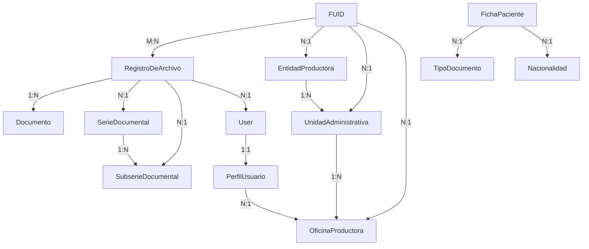
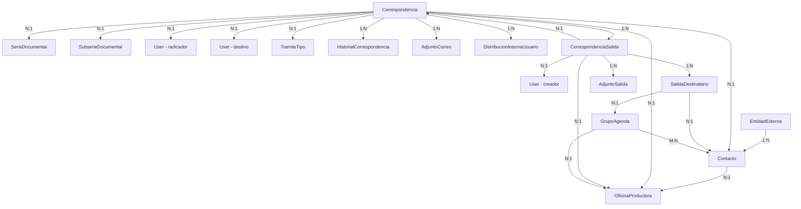
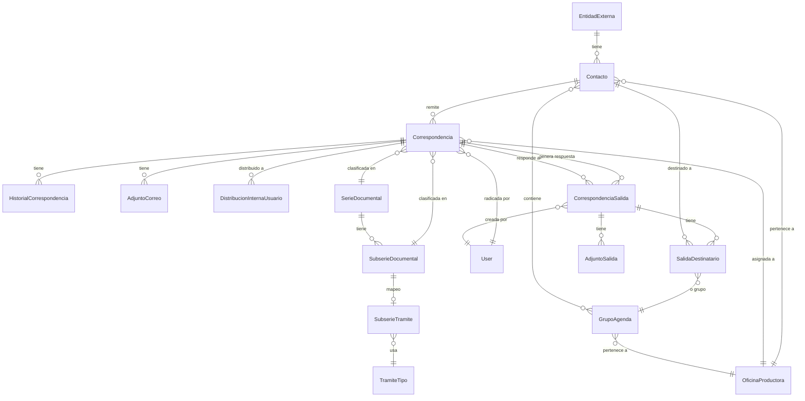

# 🗺️ MAPA COMPLETO DE MODELOS - Sistema de Gestión Documental

## 📚 ÍNDICE

1. [Módulo DOCUMENTOS](#módulo-documentos)
2. [Módulo CORRESPONDENCIA](#módulo-correspondencia)
3. [Relaciones entre Módulos](#relaciones-entre-módulos)
4. [Diagramas de Flujo](#diagramas-de-flujo)

---

## 🏥 MÓDULO DOCUMENTOS

### **Jerarquía Organizacional** (De mayor a menor)

```
EntidadProductora
    └── UnidadAdministrativa
        └── OficinaProductora
```

### **Clasificación Documental (TRD)**

```
SerieDocumental
    └── SubserieDocumental
```

### **Gestión de Archivos**

```
FUID (Formato Único de Inventario Documental)
    └── RegistroDeArchivo (many-to-many)
        └── Documento (hasta 3 archivos por registro)
```

### **Usuarios**

```
User (Django)
    └── PerfilUsuario
        └── OficinaProductora (FK)
```

### **Pacientes (Historias Clínicas)**

```
FichaPaciente
    ├── TipoDocumento (FK)
    └── Nacionalidad (FK)
```

---

## 📧 MÓDULO CORRESPONDENCIA

### **Entidades Externas y Contactos**

```
EntidadExterna (Empresas, Instituciones)
    └── Contacto (Personas)
        └── OficinaProductora (oficina_propietaria - agenda)
```

### **Correspondencia Entrante**

```
Correspondencia
    ├── Contacto (remitente) FK
    ├── SerieDocumental FK
    ├── SubserieDocumental FK
    ├── OficinaProductora (oficina_destino) FK
    ├── User (usuario_radicador) FK
    ├── User (usuario_destino_inicial) FK
    └── TramiteTipo (tramite_aplicado) FK
    
    Relaciones inversas:
    ├── HistorialCorrespondencia (historial)
    ├── AdjuntoCorreo (adjuntos)
    ├── DistribucionInternaUsuario (distribuciones)
    └── CorrespondenciaSalida (respuestas)
```

### **Correspondencia Saliente**

```
CorrespondenciaSalida
    ├── Correspondencia (respuesta_a) FK - opcional
    ├── User (creado_por) FK
    ├── OficinaProductora (oficina_remitente) FK
    ├── SerieDocumental FK
    ├── SubserieDocumental FK
    
    Relaciones:
    ├── SalidaDestinatario (destinatarios) - many
    ├── AdjuntoSalida (adjuntos) - many
    └── HistorialSalida (historial) - many
```

### **Destinatarios de Correspondencia Saliente**

```
SalidaDestinatario
    ├── CorrespondenciaSalida FK
    ├── Contacto (destinatario) FK - opcional
    ├── GrupoAgenda FK - opcional
    └── Estado de envío/lectura
```

### **Comunicación Masiva**

```
ComunicacionMasiva
    ├── User (creado_por) FK
    ├── GrupoAgenda (grupo_destinatarios) FK - opcional
    
    Relaciones:
    └── ComunicacionDestinatario (destinatarios) - many

ComunicacionDestinatario
    ├── ComunicacionMasiva FK
    ├── Contacto FK
    └── Estado de envío
```

### **Agenda de Contactos**

```
GrupoAgenda
    ├── OficinaProductora (oficina_propietaria) FK
    └── Contacto (contactos) ManyToMany
```

### **Procesamiento de Correos Entrantes**

```
CorreoEntrante
    ├── OficinaProductora (oficina_clasificada) FK
    ├── SerieDocumental (serie_clasificada) FK
    ├── SubserieDocumental (subserie_clasificada) FK
    ├── Correspondencia (radicado_asociado) FK - one-to-one
    
    Relaciones:
    └── AdjuntoCorreoEntrante (adjuntos) - many
```

### **Sistema SLA (Tiempos de Respuesta)**

```
CalendarioLaboral (Días festivos)
    └── fecha

TramiteTipo (Configuración de plazos TRD)
    └── plazo_dias_habiles

SubserieTramite (Mapeo Subserie → Trámite)
    ├── SubserieDocumental (subserie) FK - unique
    └── TramiteTipo (tramite) FK
```

### **Notificaciones**

```
Notificacion
    ├── User (usuario) FK
    ├── Correspondencia FK - opcional
    ├── CorrespondenciaSalida FK - opcional
    └── leida (boolean)
```

---

## 🔗 RELACIONES ENTRE MÓDULOS

### **DOCUMENTOS → CORRESPONDENCIA**

```
SerieDocumental ──────────┐
                          ├─→ Correspondencia
SubserieDocumental ───────┘     └─→ CorrespondenciaSalida

OficinaProductora ────────┬─→ Correspondencia (oficina_destino)
                          ├─→ CorrespondenciaSalida (oficina_remitente)
                          ├─→ Contacto (oficina_propietaria)
                          ├─→ GrupoAgenda (oficina_propietaria)
                          └─→ PerfilUsuario

User (Django) ────────────┬─→ Correspondencia (usuario_radicador)
                          ├─→ Correspondencia (usuario_destino_inicial)
                          ├─→ CorrespondenciaSalida (creado_por)
                          ├─→ HistorialCorrespondencia
                          ├─→ DistribucionInternaUsuario
                          └─→ Notificacion
```

---

## 📊 DIAGRAMAS DE MODELOS

### **1. MODELO COMPLETO DOCUMENTOS**



### **2. MODELO COMPLETO CORRESPONDENCIA**



### **3. FLUJO CORRESPONDENCIA ENTRANTE**

```
┌─────────────────┐
│ Correo/Documento│
│     Llega       │
└────────┬────────┘
         │
         ▼
┌─────────────────┐
│  CorreoEntrante │ (opcional - solo emails)
│  - clasificado  │
│  - adjuntos     │
└────────┬────────┘
         │
         ▼
┌─────────────────┐
│ RADICACIÓN      │
│ Correspondencia │
│ - Nº radicado   │
│ - Remitente     │
│ - Serie/Sub     │
│ - Oficina dest  │
└────────┬────────┘
         │
         ▼
┌─────────────────┐
│ HistorialCorre  │
│ EVENTO: RADICADA│
└────────┬────────┘
         │
         ▼
┌─────────────────┐
│ DISTRIBUCIÓN    │
│ - Oficina       │
│ - Usuario (opc) │
└────────┬────────┘
         │
         ▼
┌─────────────────┐
│ BANDEJA         │
│ - Personal      │
│ - Oficina       │
└────────┬────────┘
         │
         ▼
┌─────────────────┐
│ LECTURA         │
│ + Historial     │
└────────┬────────┘
         │
         ▼
┌─────────────────┐
│ RESPUESTA       │
│ CorrespSalida   │
└─────────────────┘
```

### **4. FLUJO CORRESPONDENCIA SALIENTE**

```
┌─────────────────┐
│ Usuario crea    │
│ Correspondencia │
│    Saliente     │
└────────┬────────┘
         │
         ▼
┌─────────────────────────┐
│ CorrespondenciaSalida   │
│ - Asunto                │
│ - Contenido             │
│ - Serie/Subserie        │
│ - Respuesta a (opcional)│
└────────┬────────────────┘
         │
         ▼
┌─────────────────────────┐
│ Seleccionar Destinos    │
│ - Individual (Contacto) │
│ - Grupo (GrupoAgenda)   │
│ - Masivo (Comunicación) │
└────────┬────────────────┘
         │
         ▼
┌─────────────────────────┐
│ SalidaDestinatario      │
│ (1 por cada destino)    │
│ - Estado: PENDIENTE     │
└────────┬────────────────┘
         │
         ▼
┌─────────────────────────┐
│ ENVÍO                   │
│ - Email / Físico        │
│ - Estado → ENVIADO      │
└────────┬────────────────┘
         │
         ▼
┌─────────────────────────┐
│ HistorialSalida         │
│ - Evento: ENVIADO       │
│ - Fecha/Usuario         │
└─────────────────────────┘
```

### **5. SISTEMA SLA (Cálculo de Plazos)**

```
Correspondencia creada
    requiere_respuesta = True
         │
         ├─── ¿Tiene subserie con TRD configurado?
         │         │
         │         ├─── SÍ → SubserieTramite → TramiteTipo
         │         │           └── plazo_dias_habiles = X días
         │         │           └── plazo_origen = 'TRD'
         │         │
         │         └─── NO → Usar tiempo_respuesta
         │                   ├── NORMAL = 15 días
         │                   ├── URGENTE = 5 días
         │                   └── MUY_URGENTE = 3 días
         │                   └── plazo_origen = 'FALLBACK'
         │
         ▼
    Cálculo de fecha límite:
    1. Aplicar corte horario (ej: 5pm)
    2. Sumar X días HÁBILES (calendario laboral)
    3. Persistir: fecha_limite_respuesta_persist
    4. Persistir: plazo_respuesta_dias
```

---

## 🎯 CAMPOS CLAVE POR MODELO

### **Correspondencia**

| Campo | Tipo | Descripción |
|-------|------|-------------|
| `numero_radicado` | CharField | ENTRANTE-2025-00001 (único) |
| `tipo_radicado` | CharField | ENTRANTE / CIRCULAR |
| `fecha_radicacion` | DateTimeField | Auto-generada |
| `remitente` | FK Contacto | Persona que envía |
| `asunto` | TextField | Descripción |
| `serie` / `subserie` | FK | Clasificación TRD |
| `medio_recepcion` | CharField | FISICO / ELECTRONICO |
| `requiere_respuesta` | Boolean | ¿Necesita respuesta? |
| `tiempo_respuesta` | CharField | NORMAL/URGENTE/MUY_URGENTE |
| `oficina_destino` | FK OficinaProductora | Oficina responsable |
| `usuario_destino_inicial` | FK User | Usuario asignado |
| `estado` | CharField | RADICADA/ASIGNADA/LEIDA/RESPONDIDA |
| `plazo_respuesta_dias` | Integer | Días hábiles (persistido) |
| `fecha_limite_respuesta_persist` | DateTimeField | Fecha calculada |
| `plazo_origen` | CharField | TRD/FALLBACK/NONE |

### **CorrespondenciaSalida**

| Campo | Tipo | Descripción |
|-------|------|-------------|
| `numero_radicado` | CharField | SALIDA-2025-00001 |
| `respuesta_a` | FK Correspondencia | Si es respuesta |
| `asunto` | TextField | Asunto del documento |
| `contenido` | TextField | Cuerpo del mensaje |
| `creado_por` | FK User | Autor |
| `oficina_remitente` | FK OficinaProductora | Oficina origen |
| `fecha_creacion` | DateTimeField | Auto |
| `estado` | CharField | BORRADOR/ENVIADO/APROBADO |

### **Contacto**

| Campo | Tipo | Descripción |
|-------|------|-------------|
| `entidad_externa` | FK EntidadExterna | Empresa/Institución |
| `nombres` | CharField | Nombre de la persona |
| `apellidos` | CharField | Apellidos |
| `cargo` | CharField | Cargo en la entidad |
| `correo_electronico` | EmailField | Email |
| `telefono_contacto` | CharField | Teléfono |
| `oficina_propietaria` | FK OficinaProductora | Agenda por oficina |

### **RegistroDeArchivo**

| Campo | Tipo | Descripción |
|-------|------|-------------|
| `numero_orden` | IntegerField | Identificador |
| `codigo_serie` | FK SerieDocumental | Serie TRD |
| `codigo_subserie` | FK SubserieDocumental | Subserie TRD |
| `unidad_documental` | CharField | Descripción |
| `soporte_fisico` | Boolean | ¿Físico? |
| `soporte_electronico` | Boolean | ¿Digital? |
| `caja` / `carpeta` | IntegerField | Ubicación física |
| `identificador_documento` | CharField | Ej: Nº Historia Clínica |
| `creado_por` | FK User | Responsable |

---

## 🔄 ESTADOS Y TRANSICIONES

### **Estados de Correspondencia Entrante**

```
┌──────────┐
│ RADICADA │ ◄── Estado inicial al crear
└─────┬────┘
      │
      ▼
┌───────────────┐
│ASIGNADA_USUARIO│ ◄── Al distribuir a usuario específico
└─────┬─────────┘
      │
      ▼
┌──────┐
│LEÍDA │ ◄── Al abrir el documento
└──┬───┘
   │
   ▼
┌────────────┐
│ RESPONDIDA │ ◄── Al crear CorrespondenciaSalida
└────────────┘
```

### **Estados de Correspondencia Saliente**

```
┌──────────┐
│ BORRADOR │ ◄── Estado inicial
└─────┬────┘
      │
      ▼
┌──────────────┐
│ PENDIENTE_   │ ◄── Si requiere aprobación
│ APROBACION   │
└─────┬────────┘
      │
      ▼
┌──────────┐
│ APROBADO │
└─────┬────┘
      │
      ▼
┌─────────┐
│ ENVIADO │ ◄── Después de enviar
└─────────┘
```

---

## 📈 CARDINALIDADES

### **Correspondencia**

- **1 Correspondencia** → N HistorialCorrespondencia
- **1 Correspondencia** → N AdjuntoCorreo
- **1 Correspondencia** → N DistribucionInternaUsuario
- **1 Correspondencia** → N CorrespondenciaSalida (respuestas)
- **N Correspondencia** → 1 Contacto (remitente)
- **N Correspondencia** → 1 OficinaProductora (destino)
- **N Correspondencia** → 1 User (radicador)

### **CorrespondenciaSalida**

- **1 CorrespondenciaSalida** → N SalidaDestinatario
- **1 CorrespondenciaSalida** → N AdjuntoSalida
- **1 CorrespondenciaSalida** → N HistorialSalida
- **N CorrespondenciaSalida** → 1 Correspondencia (respuesta_a)
- **N CorrespondenciaSalida** → 1 User (creado_por)

### **Contacto - EntidadExterna**

- **N Contacto** → 1 EntidadExterna
- **N Contacto** → 1 OficinaProductora (agenda)

### **GrupoAgenda - Contacto**

- **M GrupoAgenda** ↔ N Contacto (ManyToMany)

---

## 🛠️ PARA CREAR DIAGRAMAS VISUALES

### **Usa Draw.io con este código Mermaid:**

Copia este código en **Mermaid Live Editor** (https://mermaid.live/):



---

## 💡 TIPS PARA TU PRESENTACIÓN

### **Lo que debes poder explicar:**

1. **Flujo de Radicación**
   - "Cuando llega un documento, se crea una Correspondencia con un número único tipo ENTRANTE-2025-00001"
   - "Se asocia a un Contacto (remitente) y se asigna a una OficinaProductora"
   - "El sistema calcula automáticamente la fecha límite de respuesta"

2. **Sistema de Bandejas**
   - "Cada usuario ve documentos en dos bandejas: Personal (asignados a él) y Oficina (de toda su área)"
   - "Esto se maneja con campos: usuario_destino_inicial y oficina_destino"

3. **Trazabilidad**
   - "Cada acción genera un registro en HistorialCorrespondencia"
   - "Podemos saber quién hizo qué y cuándo en cada documento"

4. **Sistema SLA**
   - "El plazo se calcula por TRD (si está configurado) o por tiempo_respuesta"
   - "Se persiste en campos denormalizados para reportes rápidos"

5. **Correspondencia Saliente**
   - "Puede ser respuesta a un radicado entrante o comunicación nueva"
   - "Soporta envío a múltiples destinatarios (SalidaDestinatario)"

---

## 🎯 RESUMEN EJECUTIVO

**Tu sistema tiene:**

- **23 modelos principales**
- **2 módulos integrados** (Documentos + Correspondencia)
- **Trazabilidad completa** con modelos de historial
- **Sistema SLA robusto** con cálculo de plazos
- **Gestión de contactos** por oficina (agenda)
- **Correspondencia bidireccional** (entrante + saliente)
- **Comunicación masiva** con grupos
- **Clasificación TRD** completa

**Todo conectado de forma coherente y profesional.**

---

**¿Necesitas que explique algún modelo en específico o que cree un diagrama de flujo particular?**

