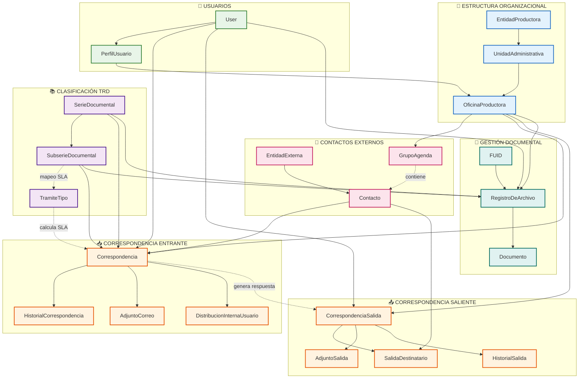
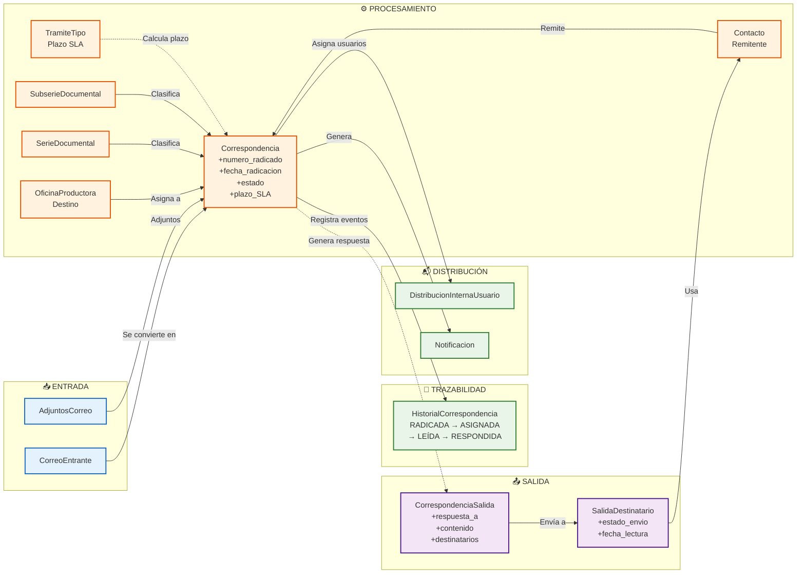
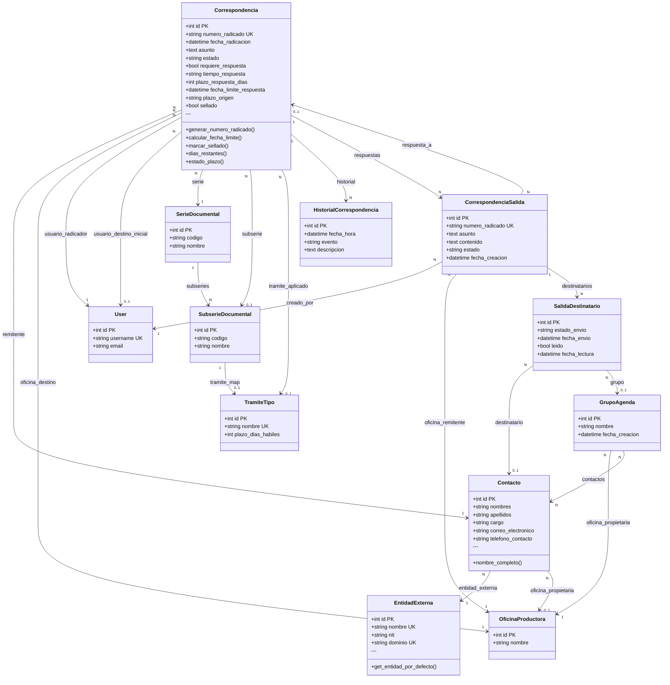
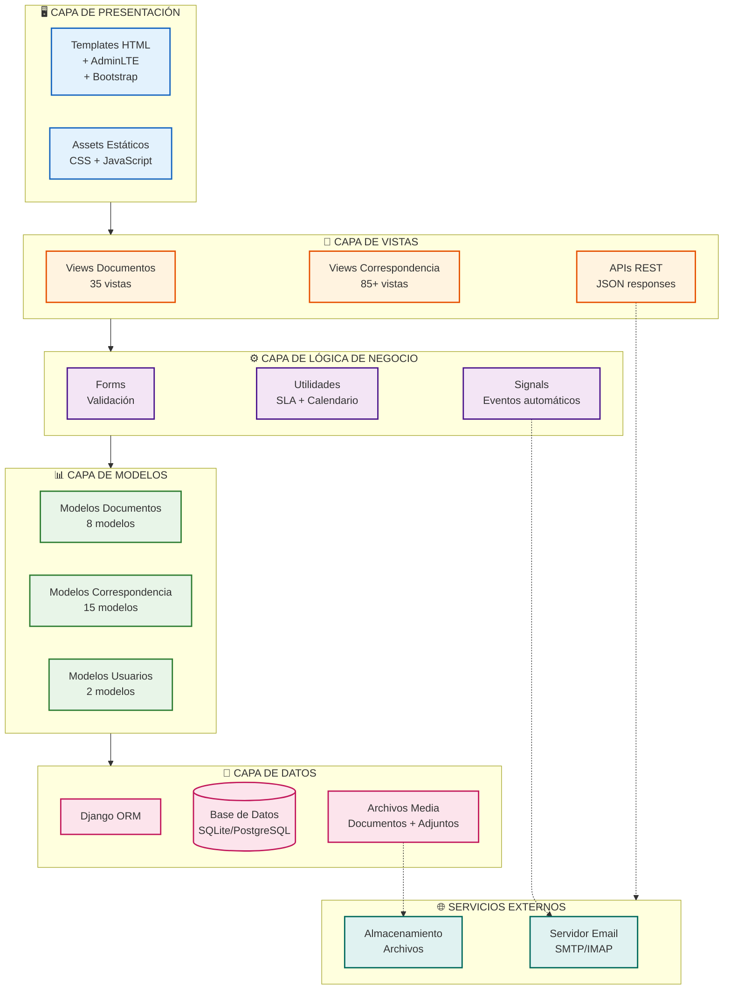

# 🗺️ DIAGRAMAS VISUALES DE MODELOS - Sistema de Gestión Documental

## 📊 DIAGRAMA 1: ENTIDAD-RELACIÓN COMPLETO (Estilo Database)

```mermaid
erDiagram
    %% ========== MÓDULO DOCUMENTOS ==========
    
    EntidadProductora ||--o{ UnidadAdministrativa : "contiene"
    UnidadAdministrativa ||--o{ OficinaProductora : "contiene"
    
    SerieDocumental ||--o{ SubserieDocumental : "tiene"
    SerieDocumental ||--o{ RegistroDeArchivo : "clasifica"
    SubserieDocumental ||--o{ RegistroDeArchivo : "clasifica"
    
    OficinaProductora ||--o{ PerfilUsuario : "pertenece"
    User ||--|| PerfilUsuario : "tiene perfil"
    
    FUID }o--|| EntidadProductora : "referencia"
    FUID }o--|| UnidadAdministrativa : "referencia"
    FUID }o--|| OficinaProductora : "referencia"
    FUID }o--o{ RegistroDeArchivo : "contiene"
    
    RegistroDeArchivo ||--o{ Documento : "tiene archivos"
    RegistroDeArchivo }o--|| User : "creado por"
    
    FichaPaciente }o--|| TipoDocumento : "tipo ID"
    FichaPaciente }o--|| Nacionalidad : "nacionalidad"
    
    %% ========== MÓDULO CORRESPONDENCIA ==========
    
    EntidadExterna ||--o{ Contacto : "tiene contactos"
    Contacto }o--|| OficinaProductora : "agenda de"
    
    Correspondencia }o--|| Contacto : "remitente"
    Correspondencia }o--|| SerieDocumental : "serie"
    Correspondencia }o--|| SubserieDocumental : "subserie"
    Correspondencia }o--|| OficinaProductora : "oficina destino"
    Correspondencia }o--|| User : "radicado por"
    Correspondencia }o--o| User : "asignado a"
    Correspondencia }o--o| TramiteTipo : "tramite aplicado"
    
    Correspondencia ||--o{ HistorialCorrespondencia : "historial"
    Correspondencia ||--o{ AdjuntoCorreo : "adjuntos"
    Correspondencia ||--o{ DistribucionInternaUsuario : "distribuido a"
    
    CorrespondenciaSalida }o--o| Correspondencia : "responde a"
    CorrespondenciaSalida }o--|| User : "creado por"
    CorrespondenciaSalida }o--|| OficinaProductora : "oficina remitente"
    CorrespondenciaSalida }o--|| SerieDocumental : "serie"
    CorrespondenciaSalida }o--o| SubserieDocumental : "subserie"
    
    CorrespondenciaSalida ||--o{ SalidaDestinatario : "destinatarios"
    CorrespondenciaSalida ||--o{ AdjuntoSalida : "adjuntos"
    CorrespondenciaSalida ||--o{ HistorialSalida : "historial"
    
    SalidaDestinatario }o--o| Contacto : "destinatario"
    SalidaDestinatario }o--o| GrupoAgenda : "grupo"
    
    GrupoAgenda }o--|| OficinaProductora : "oficina propietaria"
    GrupoAgenda }o--o{ Contacto : "contiene contactos"
    
    ComunicacionMasiva }o--|| User : "creado por"
    ComunicacionMasiva }o--o| GrupoAgenda : "grupo destinatarios"
    ComunicacionMasiva ||--o{ ComunicacionDestinatario : "destinatarios"
    
    ComunicacionDestinatario }o--|| Contacto : "contacto"
    
    CorreoEntrante }o--o| OficinaProductora : "oficina clasificada"
    CorreoEntrante }o--o| SerieDocumental : "serie clasificada"
    CorreoEntrante }o--o| SubserieDocumental : "subserie clasificada"
    CorreoEntrante }o--o| Correspondencia : "radicado asociado"
    CorreoEntrante ||--o{ AdjuntoCorreoEntrante : "adjuntos"
    
    SubserieDocumental ||--o| SubserieTramite : "mapeo TRD"
    SubserieTramite }o--|| TramiteTipo : "tramite"
    
    Notificacion }o--|| User : "usuario"
    Notificacion }o--o| Correspondencia : "correspondencia"
    Notificacion }o--o| CorrespondenciaSalida : "salida"
    
    %% ========== DEFINICIONES DE ENTIDADES ==========
    
    EntidadProductora {
        int id PK
        string nombre UK
    }
    
    UnidadAdministrativa {
        int id PK
        string nombre
        int entidad_productora_id FK
    }
    
    OficinaProductora {
        int id PK
        string nombre
        int unidad_administrativa_id FK
    }
    
    SerieDocumental {
        int id PK
        string codigo
        string nombre
    }
    
    SubserieDocumental {
        int id PK
        string codigo
        string nombre
        int serie_id FK
    }
    
    User {
        int id PK
        string username UK
        string email
        string password
    }
    
    PerfilUsuario {
        int id PK
        int user_id FK "One-to-One"
        int oficina_id FK
        string cargo
    }
    
    RegistroDeArchivo {
        int id PK
        int numero_orden
        string codigo
        int codigo_serie_id FK
        int codigo_subserie_id FK
        string unidad_documental
        date fecha_inicial
        date fecha_final
        bool soporte_fisico
        bool soporte_electronico
        int caja
        int carpeta
        string identificador_documento
        int creado_por_id FK
        datetime fecha_creacion
    }
    
    Documento {
        int id PK
        int registro_id FK
        file archivo
        datetime uploaded_at
    }
    
    FUID {
        int id PK
        int entidad_productora_id FK
        int unidad_administrativa_id FK
        int oficina_productora_id FK
        datetime fecha_creacion
        int creado_por_id FK
        string notas
    }
    
    FichaPaciente {
        int consecutivo PK
        string primer_nombre
        string primer_apellido
        string num_identificacion
        int tipo_identificacion_id FK
        date fecha_nacimiento
        bigint Numero_historia_clinica UK
        string caja
        string carpeta
        int nacionalidad_id FK
    }
    
    TipoDocumento {
        int id PK
        string nombre UK
    }
    
    Nacionalidad {
        int id PK
        string nombre UK
    }
    
    EntidadExterna {
        int id PK
        string nombre UK
        string nit
        string direccion
        string telefono
        string dominio UK
    }
    
    Contacto {
        int id PK
        int entidad_externa_id FK
        string nombres
        string apellidos
        string cargo
        string correo_electronico
        string telefono_contacto
        int oficina_propietaria_id FK
    }
    
    Correspondencia {
        int id PK
        string numero_radicado UK
        string tipo_radicado
        datetime fecha_radicacion
        int usuario_radicador_id FK
        int remitente_id FK
        text asunto
        int serie_id FK
        int subserie_id FK
        string medio_recepcion
        bool requiere_respuesta
        string tiempo_respuesta
        int plazo_respuesta_dias
        datetime fecha_limite_respuesta_persist
        string plazo_origen
        int tramite_aplicado_id FK
        string estado
        int oficina_destino_id FK
        int usuario_destino_inicial_id FK
        bool leido_por_oficina
        bool sellado
        datetime fecha_sellado
    }
    
    HistorialCorrespondencia {
        int id PK
        int correspondencia_id FK
        datetime fecha_hora
        string evento
        int usuario_id FK
        text descripcion
    }
    
    AdjuntoCorreo {
        int id PK
        int correspondencia_id FK
        file archivo
        string nombre_original
        datetime uploaded_at
    }
    
    DistribucionInternaUsuario {
        int id PK
        int correspondencia_id FK
        int usuario_asignado_id FK
        datetime fecha_asignacion
        int asignado_por_id FK
        bool leido
    }
    
    CorrespondenciaSalida {
        int id PK
        string numero_radicado UK
        int respuesta_a_id FK
        text asunto
        text contenido
        int creado_por_id FK
        int oficina_remitente_id FK
        int serie_id FK
        int subserie_id FK
        datetime fecha_creacion
        string estado
    }
    
    SalidaDestinatario {
        int id PK
        int correspondencia_salida_id FK
        int destinatario_id FK
        int grupo_id FK
        string estado_envio
        datetime fecha_envio
        bool leido
        datetime fecha_lectura
    }
    
    AdjuntoSalida {
        int id PK
        int correspondencia_salida_id FK
        file archivo
        string nombre_original
    }
    
    HistorialSalida {
        int id PK
        int correspondencia_salida_id FK
        datetime fecha_hora
        string evento
        int usuario_id FK
        text descripcion
    }
    
    GrupoAgenda {
        int id PK
        string nombre
        int oficina_propietaria_id FK
        datetime fecha_creacion
    }
    
    ComunicacionMasiva {
        int id PK
        text asunto
        text contenido
        int creado_por_id FK
        int grupo_destinatarios_id FK
        datetime fecha_creacion
        string estado
    }
    
    ComunicacionDestinatario {
        int id PK
        int comunicacion_id FK
        int contacto_id FK
        string estado_envio
        datetime fecha_envio
    }
    
    CorreoEntrante {
        int id PK
        string remitente
        text asunto
        text cuerpo_texto
        datetime fecha_recepcion
        bool procesado
        int oficina_clasificada_id FK
        int serie_clasificada_id FK
        int subserie_clasificada_id FK
        int radicado_asociado_id FK "One-to-One"
        bool requiere_revision_manual
    }
    
    AdjuntoCorreoEntrante {
        int id PK
        int correo_id FK
        file archivo
        string nombre_archivo
    }
    
    TramiteTipo {
        int id PK
        string nombre UK
        string descripcion
        int plazo_dias_habiles
    }
    
    SubserieTramite {
        int id PK
        int subserie_id FK UK
        int tramite_id FK
    }
    
    CalendarioLaboral {
        int id PK
        date fecha UK
        string descripcion
    }
    
    Notificacion {
        int id PK
        int usuario_id FK
        string tipo
        text mensaje
        bool leida
        int correspondencia_id FK
        int correspondencia_salida_id FK
        datetime fecha_creacion
    }
```

---

## 🎯 DIAGRAMA 2: RELACIONES PRINCIPALES (Simplificado para presentación)



---

## 🔄 DIAGRAMA 3: FLUJO DE DATOS (Correspondencia)



---

## 📊 DIAGRAMA 4: MÓDULOS DEL SISTEMA (Vista de Alto Nivel)

```mermaid
graph TD
    %% ========== SISTEMA PRINCIPAL ==========
    SISTEMA[🏥 SISTEMA DE GESTIÓN<br/>DOCUMENTAL Y CORRESPONDENCIA]
    
    %% ========== MÓDULOS PRINCIPALES ==========
    SISTEMA --> MOD_DOCS[📁 MÓDULO<br/>GESTIÓN DOCUMENTAL]
    SISTEMA --> MOD_CORRESP[📧 MÓDULO<br/>CORRESPONDENCIA]
    SISTEMA --> MOD_USERS[👥 MÓDULO<br/>USUARIOS]
    SISTEMA --> MOD_CONFIG[⚙️ MÓDULO<br/>CONFIGURACIÓN]
    
    %% ========== SUBMÓDULOS DOCUMENTOS ==========
    MOD_DOCS --> FUID_MOD[📋 FUID<br/>Inventarios]
    MOD_DOCS --> REG_MOD[📑 Registros<br/>de Archivo]
    MOD_DOCS --> FICHAS_MOD[🏥 Fichas<br/>de Pacientes]
    
    %% ========== SUBMÓDULOS CORRESPONDENCIA ==========
    MOD_CORRESP --> ENTRADA_MOD[📥 Correspondencia<br/>Entrante]
    MOD_CORRESP --> SALIDA_MOD[📤 Correspondencia<br/>Saliente]
    MOD_CORRESP --> CONTACTOS_MOD[👤 Gestión de<br/>Contactos]
    MOD_CORRESP --> MASIVA_MOD[📢 Comunicación<br/>Masiva]
    
    %% ========== SUBMÓDULOS USUARIOS ==========
    MOD_USERS --> PERFILES_MOD[👔 Perfiles<br/>de Usuario]
    MOD_USERS --> PERMISOS_MOD[🔐 Control<br/>de Acceso]
    MOD_USERS --> OFICINAS_MOD[🏢 Gestión de<br/>Oficinas]
    
    %% ========== SUBMÓDULOS CONFIGURACIÓN ==========
    MOD_CONFIG --> TRD_MOD[📚 Configuración<br/>TRD]
    MOD_CONFIG --> SLA_MOD[⏰ Sistema<br/>SLA]
    MOD_CONFIG --> CALENDARIO_MOD[📅 Calendario<br/>Laboral]
    
    %% ========== FUNCIONALIDADES TRANSVERSALES ==========
    SISTEMA --> TRACE[📝 TRAZABILIDAD<br/>Historial completo]
    SISTEMA --> NOTIFY[🔔 NOTIFICACIONES<br/>Alertas automáticas]
    SISTEMA --> REPORTS[📊 REPORTES<br/>Estadísticas]
    
    %% ========== ESTILOS ==========
    classDef sistema fill:#667eea,stroke:#764ba2,stroke-width:3px,color:#fff
    classDef modulo fill:#e3f2fd,stroke:#1565c0,stroke-width:2px
    classDef submodulo fill:#fff3e0,stroke:#e65100,stroke-width:2px
    classDef transversal fill:#e8f5e8,stroke:#2e7d32,stroke-width:2px
    
    class SISTEMA sistema
    class MOD_DOCS,MOD_CORRESP,MOD_USERS,MOD_CONFIG modulo
    class FUID_MOD,REG_MOD,FICHAS_MOD,ENTRADA_MOD,SALIDA_MOD,CONTACTOS_MOD,MASIVA_MOD,PERFILES_MOD,PERMISOS_MOD,OFICINAS_MOD,TRD_MOD,SLA_MOD,CALENDARIO_MOD submodulo
    class TRACE,NOTIFY,REPORTS transversal
```



---

## 🗂️ DIAGRAMA 5: MODELO DE CORRESPONDENCIA (Detallado)



---

## 💾 DIAGRAMA 6: ARQUITECTURA DE CAPAS



---

## 🎯 CÓMO USAR ESTOS DIAGRAMAS

### **Para tu presentación a directivos:**

1. **DIAGRAMA 2** - Relaciones Principales (Simplificado)
   - ✅ Fácil de entender
   - ✅ Muestra los módulos principales
   - ✅ Colores por tipo de funcionalidad

2. **DIAGRAMA 4** - Módulos del Sistema
   - ✅ Vista de alto nivel
   - ✅ Muestra las capacidades completas
   - ✅ Estructura clara

### **Para documentación técnica:**

1. **DIAGRAMA 1** - Entidad-Relación Completo
   - Todos los campos y relaciones
   - Tipos de datos
   - Llaves primarias y foráneas

2. **DIAGRAMA 5** - Modelo de Correspondencia Detallado
   - Métodos de clase
   - Propiedades calculadas
   - Relaciones específicas

### **Para equipo de desarrollo:**

1. **DIAGRAMA 3** - Flujo de Datos
   - Cómo fluye la información
   - Transformaciones de datos

2. **DIAGRAMA 6** - Arquitectura de Capas
   - Estructura del código
   - Separación de responsabilidades

---

## 🚀 PRÓXIMOS PASOS

1. **Elige el diagrama** que más te sirva para la presentación
2. **Copia el código Mermaid** a https://mermaid.live/
3. **Exporta como PNG/SVG** de alta calidad
4. **Inserta en tu presentación**

**¿Cuál diagrama prefieres para tu presentación? ¿Necesitas algún ajuste?** 🎨

