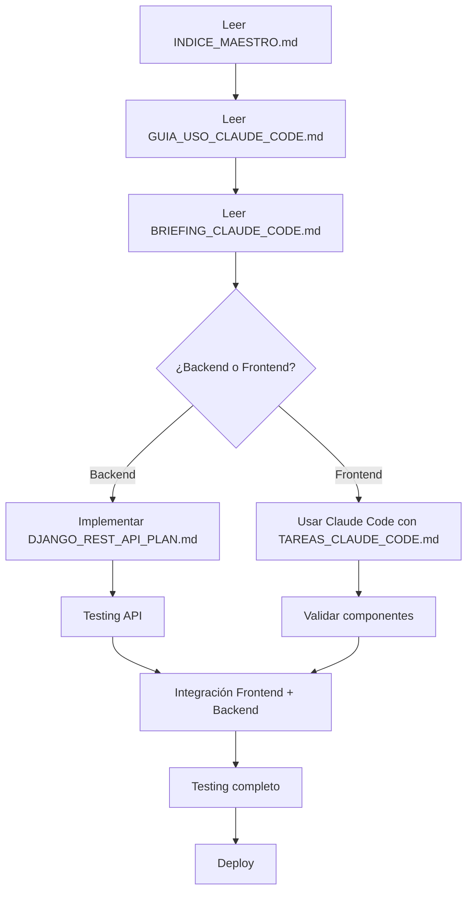

# 📚 Documentación Completa - Migración a Next.js

## 🎯 Proyecto: Calendario de Informes y Firma de Planillas

Guia principal: documentacion/mapa_topologico_archivos.md

Este README es referencia general y no impone stack ni pasos.

---

## 🚀 INICIO RÁPIDO

### Para Claude Code (Asistente AI)
```bash
cd /home/devdiego/Correspondencia-diciembre-1.0
claude "Lee documentacion/mapa_topologico_archivos.md y define el plan con criterio propio"
```

### Para Desarrolladores Humanos
1. Lee [documentacion/mapa_topologico_archivos.md](documentacion/mapa_topologico_archivos.md)
2. Lee [GUIA_USO_CLAUDE_CODE.md](./GUIA_USO_CLAUDE_CODE.md) - Instruccion de alto nivel
3. Usa el resto de docs solo si necesitas detalle

---

## 📖 DOCUMENTACIÓN DISPONIBLE

| # | Archivo | Propósito | Tiempo de Lectura |
|---|---------|-----------|-------------------|
| 🧭 | **[documentacion/mapa_topologico_archivos.md](documentacion/mapa_topologico_archivos.md)** | Guia principal de archivos | 10 min |
| 🧾 | **[documentacion/SESION_CHAT_MONITOREO_2026-03-28_164030.md](documentacion/SESION_CHAT_MONITOREO_2026-03-28_164030.md)** | Acta técnica de cambios del chat, monitoreo y Ventanilla | 8 min |
| ⭐ | **[GUIA_USO_CLAUDE_CODE.md](./GUIA_USO_CLAUDE_CODE.md)** | Instruccion de alto nivel | 5 min |
| 🔵 | **[INDICE_MAESTRO.md](./INDICE_MAESTRO.md)** | Visión general y navegación | 10 min |
| 📋 | **[BRIEFING_CLAUDE_CODE.md](./BRIEFING_CLAUDE_CODE.md)** | Resumen ejecutivo | 5 min |
| 📘 | **[CONTEXTO_MIGRACION_NEXTJS.md](./CONTEXTO_MIGRACION_NEXTJS.md)** | Arquitectura y diseño completo | 30 min |
| 💻 | **[EJEMPLOS_CODIGO_NEXTJS.md](./EJEMPLOS_CODIGO_NEXTJS.md)** | Código listo para usar | 20 min |
| ✅ | **[TAREAS_CLAUDE_CODE.md](./TAREAS_CLAUDE_CODE.md)** | Checklist detallado (60+ tareas) | Referencia |
| 🔌 | **[DJANGO_REST_API_PLAN.md](./DJANGO_REST_API_PLAN.md)** | Plan de integración backend | 20 min |

---

## 🎓 FLUJO DE TRABAJO RECOMENDADO



---

## 🎯 ¿QUÉ SE VA A CONSTRUIR?

### 1️⃣ Calendario Mensual
- Vista de calendario con estados visuales
- Verde: Firmado ✅
- Amarillo: Pendiente ⏱️
- Gris: Sin datos ⬜
- Badge con cantidad de correspondencias por día
- Navegación entre meses

### 2️⃣ Detalle del Día
- Lista de correspondencias con remitente, asunto, destinatario
- Estadísticas: total, firmadas, pendientes
- Descarga de informe Excel
- Subida de archivo firmado (PDF/imagen)
- Recolección de firmas digitales

### 3️⃣ Firma Digital
- Canvas HTML5 con soporte táctil
- Dibujo de firma con dedo o stylus
- Guardado como imagen Base64
- Preview de firma guardada

---

## 💡 CARACTERÍSTICAS PRINCIPALES

✅ **Mobile-First**: Diseñado primero para tablets y móviles  
✅ **Material-UI**: Componentes modernos y profesionales  
✅ **TypeScript**: Código type-safe y mantenible  
✅ **Responsive**: Funciona en 360px hasta 1920px+  
✅ **Touch Support**: Canvas optimizado para tablets  
✅ **API REST**: Consume Django backend existente  
✅ **Validaciones**: Cliente y servidor  
✅ **Loading States**: Feedback visual inmediato  

---

## 🛠️ STACK TECNOLÓGICO

### Frontend (Nuevo)
- **Framework**: Next.js 14 (App Router)
- **Lenguaje**: TypeScript 5+
- **UI**: Material-UI 5
- **HTTP**: Axios + SWR
- **Fechas**: date-fns
- **Upload**: react-dropzone

### Backend (Existente + API)
- **Framework**: Django 4+
- **API**: Django REST Framework
- **CORS**: django-cors-headers
- **Auth**: Django Session Auth

---

## 📊 ESTADÍSTICAS DEL PROYECTO

| Métrica | Valor |
|---------|-------|
| **Documentación** | 6 archivos, 2000+ líneas |
| **Tareas** | 60+ checklist items |
| **Componentes** | ~15 componentes React |
| **Endpoints API** | 5 endpoints Django |
| **Tiempo Estimado** | ~15 horas totales |
| **Páginas** | 2 páginas principales |
| **Hooks Custom** | 3 hooks React |

---

## 🎨 PREVIEW VISUAL

### Calendario Mensual
```
┌─────────────────────────────────────────┐
│  ← Febrero 2026 →                       │
├─────────────────────────────────────────┤
│ Lun  Mar  Mié  Jue  Vie  Sáb  Dom      │
├─────────────────────────────────────────┤
│  3    4    5    6    7    8    9       │
│ ⬜   🟨   🟩   🟨   🟩   ⬜   ⬜       │
│      📧5  📧12  📧8  📧15               │
│                                         │
│  10   11   12   13   14   15   16      │
│ 🟨   🟩   🔵   🟨   🟨   ⬜   ⬜       │
│ 📧7  📧9  📧11  📧4  📧6                │
└─────────────────────────────────────────┘
🔵 Hoy  🟨 Pendiente  🟩 Firmado  ⬜ Sin datos
```

### Detalle del Día
```
┌─────────────────────────────────────────┐
│ Informe del 12 de Febrero de 2026      │
│ Estado: 🔵 Pendiente de Firma           │
├─────────────────────────────────────────┤
│ 📊 11 Correspondencias                  │
│ 📥 3 Descargas                          │
│ ✍️ 7/11 Firmas (63.6%)                  │
├─────────────────────────────────────────┤
│ Tabla de correspondencias...            │
│ [Radicado] [Remitente] [Asunto]...     │
├─────────────────────────────────────────┤
│ [📥 Descargar Excel]                    │
│ [📤 Subir Archivo Firmado]              │
│ [✍️ Recolectar Firmas]                  │
└─────────────────────────────────────────┘
```

---

## 📦 ESTRUCTURA DE ARCHIVOS

```
📁 Documentación/
├── 📘 INDICE_MAESTRO.md              ← Navegación completa
├── ⭐ GUIA_USO_CLAUDE_CODE.md        ← Cómo trabajar con Claude Code
├── 📋 BRIEFING_CLAUDE_CODE.md        ← Resumen ejecutivo
├── 📖 CONTEXTO_MIGRACION_NEXTJS.md   ← Arquitectura completa
├── 💻 EJEMPLOS_CODIGO_NEXTJS.md      ← Código de ejemplo
├── ✅ TAREAS_CLAUDE_CODE.md          ← Checklist de tareas
├── 🔌 DJANGO_REST_API_PLAN.md        ← Plan backend
└── 📚 README_DOCUMENTACION.md        ← Este archivo

📁 Proyecto Next.js/ (se creará)
├── src/
│   ├── app/
│   │   ├── calendario/page.tsx
│   │   └── calendario/[fecha]/page.tsx
│   ├── components/
│   │   ├── calendario/DiaCelda.tsx
│   │   ├── informes/TablaCorrespondencias.tsx
│   │   └── informes/CanvasFirma.tsx
│   ├── lib/
│   │   ├── api/calendario.ts
│   │   ├── hooks/useCalendario.ts
│   │   └── types/informes.ts
│   └── styles/theme.ts
└── package.json

📁 Django Backend/ (ya existe)
├── correspondencia/
│   ├── models.py
│   ├── views.py
│   ├── api_views.py         ← NUEVO
│   ├── serializers.py       ← NUEVO
│   └── urls.py
└── settings.py
```

---

## ⏱️ ESTIMACIÓN DE TIEMPO

### Frontend (Next.js)
- Setup: 30 min
- Calendario: 2 horas
- Detalle: 2 horas
- Firma: 1.5 horas
- Polish: 2 horas
- **Subtotal**: ~8 horas

### Backend (Django API)
- Serializers: 1 hora
- Views: 1.5 horas
- Testing: 1 hora
- **Subtotal**: ~3.5 horas

### Integración y Deploy
- Integración: 1 hora
- Testing: 1 hora
- Deploy: 1 hora
- **Subtotal**: ~3 horas

### **TOTAL: ~15 horas** 
(2 días full-time o 1 semana part-time)

---

## ✅ CRITERIOS DE ÉXITO

- [ ] Calendario se ve como el diseño original (o mejor)
- [ ] Todas las funcionalidades operativas
- [ ] Funciona en móvil (360px)
- [ ] Funciona en tablet (768px) con touch
- [ ] Funciona en desktop (1920px)
- [ ] Build sin errores TypeScript
- [ ] Lighthouse score > 90
- [ ] API REST funciona correctamente
- [ ] CORS configurado
- [ ] Documentación completa

---

## 🆘 NECESITAS AYUDA?

### Si eres Claude Code
1. Lee [GUIA_USO_CLAUDE_CODE.md](./GUIA_USO_CLAUDE_CODE.md)
2. Sigue [TAREAS_CLAUDE_CODE.md](./TAREAS_CLAUDE_CODE.md)
3. Usa [EJEMPLOS_CODIGO_NEXTJS.md](./EJEMPLOS_CODIGO_NEXTJS.md) como referencia

### Si eres Desarrollador
1. Lee [INDICE_MAESTRO.md](./INDICE_MAESTRO.md) primero
2. Revisa [CONTEXTO_MIGRACION_NEXTJS.md](./CONTEXTO_MIGRACION_NEXTJS.md)
3. Consulta ejemplos en [EJEMPLOS_CODIGO_NEXTJS.md](./EJEMPLOS_CODIGO_NEXTJS.md)

### Si eres Backend Developer
1. Ve directo a [DJANGO_REST_API_PLAN.md](./DJANGO_REST_API_PLAN.md)
2. Implementa serializers y views
3. Prueba con curl o Postman

---

## 🎯 PRÓXIMOS PASOS

### Paso 1: Lectura Rápida (20 min)
- [ ] Leer este README
- [ ] Leer INDICE_MAESTRO.md
- [ ] Leer BRIEFING_CLAUDE_CODE.md

### Paso 2: Backend (3 horas)
- [ ] Implementar DJANGO_REST_API_PLAN.md
- [ ] Probar endpoints con curl
- [ ] Configurar CORS

### Paso 3: Frontend con Claude Code (8 horas)
- [ ] Seguir TAREAS_CLAUDE_CODE.md fase por fase
- [ ] Validar cada componente
- [ ] Testing responsive continuo

### Paso 4: Integración (2 horas)
- [ ] Conectar Next.js con Django API
- [ ] Resolver issues CORS/cookies
- [ ] Testing end-to-end

### Paso 5: Deploy (2 horas)
- [ ] Build de producción
- [ ] Deploy a servidor
- [ ] Testing en producción

---

## 📞 CONTACTO Y SOPORTE

- **Documentación**: Todos los archivos .md en esta carpeta
- **Claude Code**: Usa GUIA_USO_CLAUDE_CODE.md
- **Issues Técnicos**: Revisa secciones de Troubleshooting

---

## 🎉 ¡LISTO PARA COMENZAR!

Todo está documentado y listo. Tienes:
- ✅ 6 archivos de documentación (2000+ líneas)
- ✅ Código de ejemplo listo para usar
- ✅ Checklist completo (60+ tareas)
- ✅ Plan de backend detallado
- ✅ Guía para Claude Code
- ✅ Estimaciones realistas

**Comienza leyendo [INDICE_MAESTRO.md](./INDICE_MAESTRO.md) o usa Claude Code con [GUIA_USO_CLAUDE_CODE.md](./GUIA_USO_CLAUDE_CODE.md)**

---

**Creado**: 17 de febrero de 2026  
**Versión**: 1.0  
**Para**: Migración Django → Next.js  
**Proyecto**: Sistema de Calendario de Informes

🚀 **¡Éxito en tu migración!**
