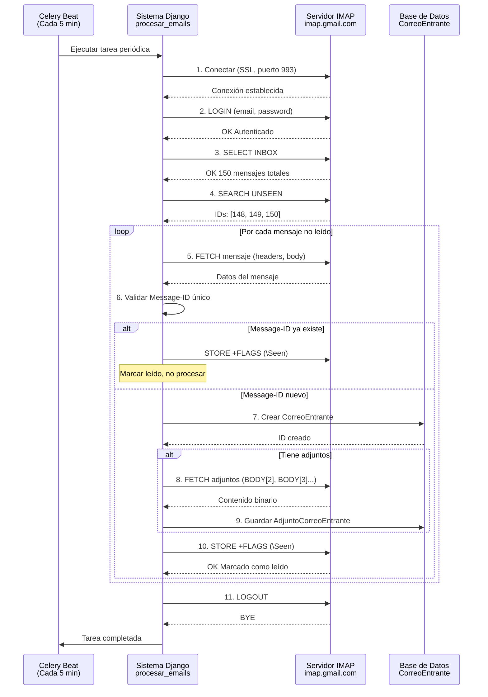

# 📧 GUÍA COMPLETA DEL PROTOCOLO IMAP
## Sistema de Correspondencia Hospitalaria

**Fecha:** 21 de octubre de 2025  
**Preparado para:** Presentación técnica  
**Nivel:** Explicación completa con ejemplos del sistema

---

## 📚 ÍNDICE

1. [¿Qué es IMAP?](#qué-es-imap)
2. [¿Cómo funciona IMAP?](#cómo-funciona-imap)
3. [IMAP vs POP3 vs SMTP](#imap-vs-pop3-vs-smtp)
4. [Implementación en Nuestro Sistema](#implementación-en-nuestro-sistema)
5. [Flujo Completo del Proceso](#flujo-completo-del-proceso)
6. [Preguntas y Respuestas Frecuentes](#preguntas-y-respuestas-frecuentes)

---

## 🎯 ¿QUÉ ES IMAP?

### **Definición Técnica:**

**IMAP** = **Internet Message Access Protocol** (Protocolo de Acceso a Mensajes de Internet)

**RFC 3501** - Estándar internacional para acceso a correo electrónico

### **Propósito:**

Permite a un cliente de correo **acceder y gestionar** mensajes de email que están almacenados en un **servidor de correo remoto**, sin necesidad de descargarlos completamente al dispositivo local.

### **Características Principales:**

✅ **Los emails se mantienen en el servidor** (no se eliminan al leer)  
✅ **Sincronización bidireccional** (cambios en cliente se reflejan en servidor y viceversa)  
✅ **Acceso desde múltiples dispositivos** (todos ven los mismos correos)  
✅ **Gestión de carpetas** en el servidor (INBOX, Enviados, Borradores, etc.)  
✅ **Búsqueda en el servidor** (sin descargar todos los correos)  
✅ **Lectura selectiva** (solo headers, solo cuerpo, solo adjuntos)

---

## 🔧 ¿CÓMO FUNCIONA IMAP?

### **Modelo Cliente-Servidor:**

```
┌─────────────────┐         IMAP          ┌─────────────────┐
│   CLIENTE       │ ◄──────────────────► │   SERVIDOR      │
│ (Tu Aplicación) │   Puerto 993 SSL     │   (Gmail)       │
│                 │   Puerto 143 normal  │                 │
└─────────────────┘                       └─────────────────┘
```

### **Proceso de Conexión IMAP:**

#### **1. CONEXIÓN**
```python
# Línea 39-41 del código
mailbox = MailBox(IMAP_SERVER)  # imap.gmail.com
mailbox._factory = partial(imaplib.IMAP4_SSL, IMAP_SERVER, IMAP_PORT)
mailbox.login(EMAIL_ACCOUNT, EMAIL_PASSWORD, initial_folder='INBOX')
```

**Qué sucede:**
1. Se establece conexión **SSL/TLS** al puerto **993** (segura)
2. Se envían credenciales (usuario y contraseña)
3. El servidor valida y devuelve **OK** o **NO**
4. Se selecciona la carpeta inicial: `INBOX`

#### **2. AUTENTICACIÓN**

**Comandos IMAP internos (lo que hace la librería):**
```
C: A001 LOGIN "hospitalsararecolombia@gmail.com" "wtucnvfcmulbwtsm"
S: A001 OK LOGIN completed
```

- `C:` = Cliente (tu aplicación)
- `S:` = Servidor (Gmail)
- `A001` = Tag de comando (identificador único)

#### **3. SELECCIÓN DE CARPETA**

```
C: A002 SELECT INBOX
S: * 150 EXISTS        (Hay 150 mensajes en total)
S: * 5 RECENT          (5 mensajes nuevos)
S: * FLAGS (\Answered \Flagged \Deleted \Seen \Draft)
S: A002 OK SELECT completed
```

#### **4. BÚSQUEDA DE CORREOS**

```python
# Línea 45 del código
messages = mailbox.fetch(AND(seen=False), mark_seen=False, bulk=True)
```

**Comando IMAP real:**
```
C: A003 SEARCH UNSEEN
S: * SEARCH 148 149 150  (IDs de mensajes no leídos)
S: A003 OK SEARCH completed
```

**Filtros disponibles:**
- `UNSEEN` - No leídos
- `SEEN` - Leídos
- `FROM "email@domain.com"` - De un remitente específico
- `SUBJECT "asunto"` - Con cierto asunto
- `SINCE "01-Jan-2025"` - Desde una fecha
- `BEFORE "31-Dec-2025"` - Antes de una fecha

#### **5. OBTENCIÓN DE MENSAJES**

```python
# Línea 54-56 del código
for i, msg in enumerate(emails_to_process):
    message_id = msg.headers.get('message-id', [''])[0]
    from_email = msg.from_
    subject = msg.subject
    cuerpo_texto = msg.text
    cuerpo_html = msg.html
```

**Comando IMAP real:**
```
C: A004 FETCH 150 (FLAGS BODY.PEEK[HEADER] BODY.PEEK[TEXT])
S: * 150 FETCH (FLAGS (\Seen) BODY[HEADER] {512}
   From: ciudadano@gmail.com
   To: hospitalsararecolombia@gmail.com
   Subject: Solicitud de información
   Message-ID: <12345@gmail.com>
   ...
   BODY[TEXT] {1024}
   Solicito información sobre...
S: A004 OK FETCH completed
```

**Nota:** `BODY.PEEK` = Leer **sin marcar como leído** (importante)

#### **6. DESCARGA DE ADJUNTOS**

```python
# Línea 101-115 del código
if msg.attachments:
    for att in msg.attachments:
        filename = att.filename
        content = att.payload  # Bytes del archivo
        content_type = att.content_type
        adjunto.archivo.save(filename, ContentFile(content), save=True)
```

**Comando IMAP real:**
```
C: A005 FETCH 150 (BODY[2])  # Parte 2 = primer adjunto
S: * 150 FETCH (BODY[2] {204800}
   [contenido binario del PDF de 200KB]
S: A005 OK FETCH completed
```

#### **7. MARCAR COMO LEÍDO**

```python
# Línea 127 del código
mailbox.flag(msg.uid, MailMessageFlags.SEEN, True)
```

**Comando IMAP real:**
```
C: A006 STORE 150 +FLAGS (\Seen)
S: * 150 FETCH (FLAGS (\Seen))
S: A006 OK STORE completed
```

#### **8. CIERRE DE CONEXIÓN**

```python
# Línea 162 del código
mailbox.logout()
```

**Comando IMAP real:**
```
C: A007 LOGOUT
S: * BYE IMAP4rev1 Server logging out
S: A007 OK LOGOUT completed
```

---

## 📊 IMAP vs POP3 vs SMTP

### **Tabla Comparativa:**

| Característica | IMAP | POP3 | SMTP |
|----------------|------|------|------|
| **Propósito** | **Leer** correos del servidor | **Descargar** correos del servidor | **Enviar** correos al servidor |
| **Puerto estándar** | 143 (normal), 993 (SSL) | 110 (normal), 995 (SSL) | 25 (normal), 587 (TLS), 465 (SSL) |
| **Correos en servidor** | ✅ Permanecen | ❌ Se eliminan después de descargar | N/A (solo envío) |
| **Múltiples dispositivos** | ✅ Sí, sincronizados | ❌ No, solo en un dispositivo | N/A |
| **Gestión de carpetas** | ✅ Sí | ❌ No | N/A |
| **Búsqueda en servidor** | ✅ Sí | ❌ No | N/A |
| **Uso de ancho de banda** | Moderado (solo lo necesario) | Alto (descarga todo) | Bajo |
| **Uso de espacio local** | Bajo (caché opcional) | Alto (todo se descarga) | N/A |
| **Mejor para** | Múltiples dispositivos, acceso web | Dispositivo único, acceso offline | Envío de correos |

### **¿Por qué IMAP y no POP3 en nuestro sistema?**

✅ **IMAP permite:**
1. **Múltiples accesos** - Varios funcionarios pueden acceder al mismo correo institucional
2. **No eliminar correos** - Se mantienen en el servidor para auditoría
3. **Gestión de carpetas** - Podemos organizar en "Procesados", "Bounces", etc.
4. **Búsqueda eficiente** - Filtrar correos no leídos sin descargar todo
5. **Sincronización** - Si se marca como leído desde el sistema, también se marca en Gmail web

---

## 💻 IMPLEMENTACIÓN EN NUESTRO SISTEMA

### **Configuración Actual:**

```python
# hospital_document_management/settings.py
IMAP_SERVER = 'imap.gmail.com'
IMAP_PORT = 993  # SSL/TLS
EMAIL_ACCOUNT = 'hospitalsararecolombia@gmail.com'
EMAIL_PASSWORD = 'wtucnvfcmulbwtsm'  # Contraseña de aplicación
```

### **Librería Utilizada:**

```python
# correspondencia/management/commands/procesar_emails.py
from imap_tools import MailBox, AND, MailMessageFlags
```

**`imap_tools`** - Librería Python que simplifica el uso de IMAP  
- **Documentación:** https://pypi.org/project/imap-tools/
- **Ventajas:** Abstrae comandos IMAP complejos, manejo automático de errores

### **Proceso Implementado:**

#### **Paso 1: Conexión Segura (SSL)**

```python
mailbox = MailBox(IMAP_SERVER)
mailbox._factory = partial(imaplib.IMAP4_SSL, IMAP_SERVER, IMAP_PORT)
```

**¿Por qué `IMAP4_SSL`?**
- Conexión **encriptada** desde el inicio
- Puerto 993 (estándar para IMAP seguro)
- **No se transmiten credenciales en texto plano**

#### **Paso 2: Autenticación con Gmail**

```python
mailbox.login(EMAIL_ACCOUNT, EMAIL_PASSWORD, initial_folder='INBOX')
```

**Importante:** Gmail requiere **contraseña de aplicación**, no la contraseña normal  
- Se genera en: https://myaccount.google.com/apppasswords
- Formato: `xxxx xxxx xxxx xxxx` (sin espacios en el código)

#### **Paso 3: Búsqueda de Correos No Leídos**

```python
messages = mailbox.fetch(AND(seen=False), mark_seen=False, bulk=True)
```

**Parámetros:**
- `AND(seen=False)` - Filtro: solo correos NO VISTOS
- `mark_seen=False` - **NO marcar como leído** al buscar
- `bulk=True` - Obtener todos los resultados de una vez

#### **Paso 4: Procesamiento de Cada Mensaje**

```python
for i, msg in enumerate(emails_to_process):
    # 1. Extraer metadatos
    message_id = msg.headers.get('message-id', [''])[0]
    from_email = msg.from_
    subject = msg.subject
    fecha_recepcion = msg.date
    
    # 2. Extraer contenido
    cuerpo_texto = msg.text or ""
    cuerpo_html = msg.html or ""
    
    # 3. Guardar en base de datos
    correo_entrante_obj = CorreoEntrante.objects.create(
        message_id=message_id,
        remitente=from_email.lower(),
        asunto=subject[:500],
        cuerpo_texto=cuerpo_texto,
        cuerpo_html=cuerpo_html,
        fecha_recepcion_original=fecha_recepcion,
    )
```

#### **Paso 5: Procesamiento de Adjuntos**

```python
if msg.attachments:
    for att in msg.attachments:
        filename = att.filename or f"adjunto_{timezone.now().timestamp()}"
        content = att.payload  # Contenido en bytes
        content_type = att.content_type or "application/octet-stream"
        
        adjunto = AdjuntoCorreoEntrante(
            correo_entrante=correo_entrante_obj,
            nombre_original=filename,
            tipo_mime=content_type
        )
        adjunto.archivo.save(filename, ContentFile(content), save=True)
```

#### **Paso 6: Marcar como Leído (Importante)**

```python
# Solo DESPUÉS de procesar y guardar exitosamente
mailbox.flag(msg.uid, MailMessageFlags.SEEN, True)
```

**¿Por qué marcar DESPUÉS?**
- Si hay un error al guardar, el correo **NO se marca como leído**
- Permite **reintentos automáticos** en la próxima ejecución
- Evita **pérdida de correos** por fallos temporales

#### **Paso 7: Cierre de Conexión**

```python
finally:
    if mailbox:
        mailbox.logout()
```

**Importante:** Siempre cerrar la conexión (`finally`) para liberar recursos

---

## 🔄 FLUJO COMPLETO DEL PROCESO

### **Diagrama de Secuencia:**



### **Cronograma de Ejecución:**

```
📅 AUTOMATIZACIÓN CON CELERY BEAT

┌─────────────────────────────────────────────────────┐
│  Tiempo    │  Acción                                 │
├────────────┼─────────────────────────────────────────┤
│  00:00:00  │  ✅ Ejecuta procesar_emails             │
│  00:05:00  │  ✅ Ejecuta procesar_emails             │
│  00:10:00  │  ✅ Ejecuta procesar_emails             │
│            │     + procesar_rebotes (cada 10 min)    │
│  00:15:00  │  ✅ Ejecuta procesar_emails             │
│  00:20:00  │  ✅ Ejecuta procesar_emails             │
│            │     + procesar_rebotes                  │
│  ...       │  ...                                    │
└────────────┴─────────────────────────────────────────┘

Configurado en: hospital_document_management/settings.py
Líneas 267-279
```

---

## ❓ PREGUNTAS Y RESPUESTAS FRECUENTES

### **1. ¿Por qué usamos IMAP y no descargamos los correos con POP3?**

**R:** IMAP permite que los correos permanezcan en el servidor, lo que es esencial para:
- **Auditoría:** Mantener registro histórico en Gmail
- **Acceso múltiple:** Varios funcionarios pueden ver el buzón institucional
- **Respaldo:** Si falla la base de datos local, los correos siguen en Gmail
- **Gestión de carpetas:** Podemos organizar correos en carpetas (Procesados, Bounces, etc.)

---

### **2. ¿Qué es `mark_seen=False` y por qué es importante?**

**R:** Es un parámetro que indica **NO marcar el correo como leído** al momento de leerlo.

**Proceso correcto:**
1. Buscar correos no leídos (`mark_seen=False`)
2. Procesar y guardar en BD
3. **SOLO SI TODO FUE EXITOSO**, marcar como leído

**Ventaja:** Si hay un error (BD caída, disco lleno, etc.), el correo **NO se marca como leído** y se procesará en el próximo ciclo (5 minutos después).

---

### **3. ¿Qué es el `Message-ID` y por qué lo validamos?**

**R:** Es un identificador **ÚNICO** de cada email, generado por el servidor que lo envió.

**Formato:** `<1234567890.12345@gmail.com>`

**¿Por qué validamos?**
```python
if CorreoEntrante.objects.filter(message_id=message_id).exists():
    # Ya existe, marcar como leído y omitir
    mailbox.flag(msg.uid, MailMessageFlags.SEEN, True)
    continue
```

**Previene:**
- **Duplicados** en la base de datos
- **Reprocesamiento** del mismo correo
- **Errores** por constraint de unicidad

---

### **4. ¿Cada cuánto se ejecuta el proceso IMAP?**

**R:** Cada **5 minutos** automáticamente, configurado con Celery Beat:

```python
# settings.py línea 268-272
'procesar-emails-cada-5-minutos': {
    'task': 'correspondencia.tasks.procesar_emails_periodico',
    'schedule': 300.0,  # 300 segundos = 5 minutos
}
```

**Beneficios:**
- **Balance** entre tiempo real y carga del servidor
- **No sobrecargar** el servidor IMAP de Gmail
- **Suficientemente rápido** para correspondencia administrativa

---

### **5. ¿Qué pasa si Gmail está caído o hay error de conexión?**

**R:** El sistema tiene manejo robusto de errores:

```python
except imaplib.IMAP4.error as e_imap:
    logger.error(f"Error IMAP: {e_imap}")
    if "authentication failed" in str(e_imap).lower():
        logger.error("Verifica credenciales")
    elif "please log in" in str(e_imap).lower():
        logger.error("Error de login")
```

**Comportamiento:**
1. Se registra el error en logs
2. La tarea termina **sin marcar correos como leídos**
3. En **5 minutos** se reintenta automáticamente
4. Los correos quedan **intactos** en Gmail

---

### **6. ¿Cómo procesamos los adjuntos grandes?**

**R:** IMAP permite descarga **selectiva** por partes (MIME parts):

```python
for att in msg.attachments:
    content = att.payload  # Solo este adjunto, no todo el mensaje
    adjunto.archivo.save(filename, ContentFile(content))
```

**Ventajas:**
- No se descarga todo el mensaje de una vez
- Gestión eficiente de memoria
- Se puede pausar/continuar si hay error en un adjunto específico

---

### **7. ¿Por qué usamos SSL/TLS (puerto 993) y no puerto 143?**

**R:** **Seguridad y cumplimiento normativo:**

| Puerto 143 (IMAP normal) | Puerto 993 (IMAP SSL) |
|--------------------------|----------------------|
| ❌ Texto plano | ✅ Encriptado |
| ❌ Credenciales visibles | ✅ Credenciales seguras |
| ❌ Contenido interceptable | ✅ Contenido protegido |
| ❌ No cumple GDPR/Ley 1581 | ✅ Cumple normativa |

**Ley 1581 de 2012 (Colombia):** Obliga a proteger datos personales con medidas técnicas adecuadas. **SSL/TLS es obligatorio.**

---

### **8. ¿Qué es una "contraseña de aplicación" de Gmail?**

**R:** Es una contraseña **específica** para aplicaciones que acceden a Gmail vía IMAP/SMTP.

**¿Por qué no la contraseña normal?**
- Gmail bloquea "aplicaciones menos seguras" por defecto
- Requiere autenticación de 2 factores (2FA)
- Contraseña de aplicación = Acceso **sin** poner tu contraseña real

**Cómo generarla:**
1. Ir a https://myaccount.google.com/apppasswords
2. Seleccionar "Otra (nombre personalizado)"
3. Gmail genera: `xxxx xxxx xxxx xxxx`
4. Usar en el código **sin espacios:** `xxxxxxxxxxxxxxxx`

---

### **9. ¿Cómo sabemos si un correo tiene adjuntos antes de descargarlo?**

**R:** IMAP envía información de **estructura MIME** sin descargar el contenido:

```
C: FETCH 150 (BODYSTRUCTURE)
S: * 150 FETCH (BODYSTRUCTURE (
    ("text" "plain" ...) 
    ("text" "html" ...) 
    ("application" "pdf" ("name" "documento.pdf") ...) 
))
```

La librería `imap_tools` analiza esto y expone:
```python
if msg.attachments:  # Sabe que hay adjuntos SIN descargarlos
    for att in msg.attachments:  # Ahora sí los descarga uno por uno
```

---

### **10. ¿Podríamos usar IMAP para enviar correos?**

**R:** **NO**. IMAP es solo para **LEER** correos del servidor.

**Para ENVIAR** se usa **SMTP** (Simple Mail Transfer Protocol):
- Puerto 587 (TLS)
- Puerto 465 (SSL)
- Configurado en `settings.py` línea 302-308

**Analogía:**
- **IMAP** = Ir al buzón de correos a **recoger** cartas
- **SMTP** = Ir a la oficina postal a **enviar** cartas

---

### **11. ¿Qué pasa si procesamos un correo dos veces por error?**

**R:** **No pasa nada**, está protegido:

```python
if CorreoEntrante.objects.filter(message_id=message_id).exists():
    # Ya existe en BD
    mailbox.flag(msg.uid, MailMessageFlags.SEEN, True)  # Solo marcar leído
    continue  # Saltar al siguiente
```

**Garantías:**
1. `message_id` es **UNIQUE** en la BD (constraint)
2. Si ya existe, solo se marca como leído
3. No se duplican registros
4. No se reprocesa

---

### **12. ¿Cuánto tarda el proceso completo de IMAP?**

**R:** Depende de la cantidad de correos nuevos:

| Escenario | Tiempo Aproximado |
|-----------|-------------------|
| 0 correos nuevos | **2-3 segundos** (solo conexión + búsqueda) |
| 1-5 correos sin adjuntos | **5-10 segundos** |
| 1-5 correos con adjuntos | **15-30 segundos** |
| 10+ correos con adjuntos | **1-2 minutos** |

**Optimización:** Se procesa en **transacciones atómicas** (`transaction.atomic()`) para garantizar consistencia.

---

## 📚 REFERENCIAS TÉCNICAS

### **RFC (Request for Comments) - Estándares:**

1. **RFC 3501** - IMAP4rev1 Protocol  
   https://tools.ietf.org/html/rfc3501

2. **RFC 2045-2049** - MIME (Multipurpose Internet Mail Extensions)  
   Estructura de mensajes y adjuntos

3. **RFC 2177** - IMAP IDLE  
   Notificaciones en tiempo real (no usado actualmente)

4. **RFC 5321** - SMTP Protocol  
   Para comparación con protocolo de envío

### **Documentación de Librerías:**

- **imap-tools:** https://pypi.org/project/imap-tools/
- **imaplib (Python stdlib):** https://docs.python.org/3/library/imaplib.html

---

## ✅ RESUMEN PARA PRESENTACIÓN

### **Puntos Clave a Mencionar:**

1. ✅ **IMAP mantiene correos en el servidor** - No se eliminan, permanecen para auditoría
2. ✅ **Conexión segura SSL/TLS puerto 993** - Cumple normativa de protección de datos
3. ✅ **Procesamiento automático cada 5 minutos** - Balance tiempo real / eficiencia
4. ✅ **Validación de duplicados por Message-ID** - No se reprocesa la misma correspondencia
5. ✅ **Manejo robusto de errores** - Si falla, se reintenta automáticamente
6. ✅ **Descarga selectiva de adjuntos** - Eficiencia en ancho de banda y almacenamiento
7. ✅ **Marca como leído SOLO después de guardar exitosamente** - No se pierden correos

### **Diferenciadores vs Otros Sistemas:**

- 🏆 Sincronización bidireccional con Gmail
- 🏆 Múltiples dispositivos pueden acceder al buzón institucional
- 🏆 Respaldo automático en la nube (Gmail)
- 🏆 Gestión de carpetas para organización

---

**Elaborado por:** Equipo Técnico - Sistema de Correspondencia  
**Fecha:** 21 de octubre de 2025  
**Versión:** 1.0  
**Estado:** Listo para Presentación

